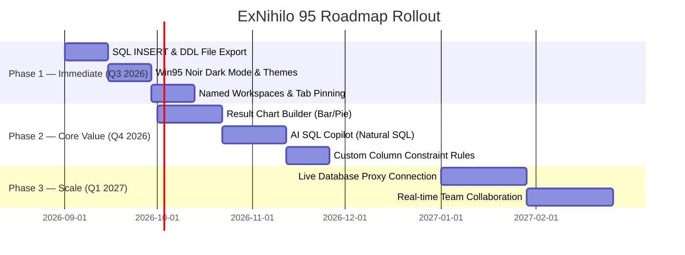

# 📋 ExNihilo 95 — Feature Checklist & Implementation Status

> **Project Status Dashboard**  
> Tracks all completed, partial, and planned features across the ExNihilo 95 engine, UI, storage, AI, and premium roadmap.

---

## 📊 Summary Dashboard

| Metric | Status |
| :--- | :---: |
| **Total Tracked Features** | **98 Features** |
| **✅ Fully Implemented** | **62 Features** (63%) |
| **🟡 Partially Implemented** | **6 Features** (6%) |
| **❌ Pending Roadmap** | **30 Features** (31%) |
| **Overall Completion** | **~63% Functional Baseline** |

```
Progress: [███████████████████████████████░░░░░░░░░░░░░░░░] 63% Completed
```

---

## 📑 Feature Checklist by Module

- [1. Core SQL Engine & Dialects](#1-core-sql-engine--dialect-parser)
- [2. Workspace, Tabs & Persistence](#2-workspace-tabs--storage-persistence)
- [3. Control Panel & User Accounts](#3-control-panel--user-accounts)
- [4. Data Export & Reporting](#4-data-export--reporting)
- [5. AI SQL Assistant (Copilot)](#5-ai-sql-assistant-copilot)
- [6. Data Visualization & Charts](#6-data-visualization--chart-builder)
- [7. Data Generation & Custom Rules](#7-data-generation--custom-rules)
- [8. Live Database Connections](#8-real-database-connections-live-mode)
- [9. UI, Themes & Nostalgia Skins](#9-ui-themes--nostalgia-skins)
- [10. Collaboration & Teaching Mode](#10-collaboration--teaching-mode)

---

### 1. Core SQL Engine & Dialect Parser

- [x] **Zero-Config Execution**: Parse and execute queries against non-existent tables without pre-defining schemas.
- [x] **MySQL Dialect**: Full parsing, syntax highlighting, and execution.
- [x] **PostgreSQL Dialect**: Supports `::type` casting, `WITH` CTEs, and `STRING_AGG()`.
- [x] **SQLite Dialect**: In-browser WebAssembly execution engine (`sql.js 3.49.1`).
- [x] **T-SQL / SSMS Dialect**: Supports bracketed identifiers (`[dbo].[users]`), `TOP n`, and Transact-SQL syntax.
- [x] **Window Functions Engine**: `ROW_NUMBER()`, `RANK()`, `DENSE_RANK()`, `LEAD()`, `LAG()`, and sliding frames (`ROWS BETWEEN`).
- [x] **Recursive CTEs**: `WITH RECURSIVE` hierarchical graph & tree traversal.
- [x] **Joins Suite**: `INNER JOIN`, `LEFT JOIN`, `RIGHT JOIN`, and `FULL OUTER JOIN`.
- [x] **DDL Support**: `CREATE DATABASE`, `CREATE SCHEMA`, `TRUNCATE TABLE`.
- [x] **Virtualized Views**: `CREATE VIEW` registered in `SessionCatalog` shadow state without data duplication.
- [x] **Native WASM Triggers**: `CREATE TRIGGER` native event execution during `INSERT`/`UPDATE`/`DELETE`.

---

### 2. Workspace, Tabs & Storage Persistence

- [x] **Multi-Tab Query Workspace**: Tab bar (`Query 1`, `Query 2`), tab switching, and tab creation/closing.
- [x] **IndexedDB Persistence Adapter**: Custom `useWorkspaceStorage` bypassing 5MB `localStorage` limit.
- [x] **500ms Debounced Auto-Save**: Background sync buffering tab edits and query states to IndexedDB every 500ms.
- [x] **Query History Log Drawer**: Scrollable session query history with timestamps, execution duration (ms), row counts, and 1-click query reload.
- [x] **Session Memory Reset**: 1-click Recycle Bin reset restoring clean memory state & resetting Session Catalog.
- [x] **Tab Pinning (`📌`)**: Pin critical query tabs to lock them on the left and protect against accidental closure.
- [ ] **Unlimited Query Tabs** *(Free: 3 tabs max; Pro: Unlimited)*.
- [ ] **Tab Grouping**: Color-coded tab groups with drag-to-reorder.
- [ ] **Cloud Workspace Sync**: Cross-device workspace auto-sync on user login.
- [ ] **Git-Style Tab Version History**: Revert query tabs to previous snapshots with diff view.

---

### 3. Control Panel & User Accounts

- [x] **ExNihilo Control Panel (`AdminDashboard.tsx`)**: 4-tab user window (`My Account`, `Upgrade to Pro`, `Usage Statistics`, `Log Out`).
- [x] **Header Account Banner**: Vintage avatar badge, `@username`, Member Since date, and Tier Badge (`[ FREE ]`, `[ PRO ]`).
- [x] **Local Account Security**: Client-side authentication with PBKDF2 600,000-iteration password hashing and salt storage.
- [x] **Real-Time Live Analytics Dashboard**: Live SVG charts (`Query Latency`, `Rows Produced`, `Memory Growth`, `Latency Trend`).
- [x] **Regional Currency Detection**: Auto-detects local currency (`INR`, `USD`, `EUR`, `GBP`) with **`ℹ️ Subject to Update`** callout badges.
- [ ] **OAuth Login Integration**: Sign in with GitHub / Google account.
- [ ] **Multi-Factor Authentication (MFA)**: Optional 2FA security verification.

---

### 4. Data Export & Reporting

- [x] **CSV Grid Export**: 1-click export of SQL query results to CSV.
- [x] **JSON Log Export**: Download session query history logs as `.json` (`exnihilo_session_logs_<username>.json`).
- [x] **Session Text Report Export**: Generate and download session summary report in `.txt` format.
- [x] **SQL `INSERT` Script Export**: Export synthesized mock data as executable `INSERT INTO table VALUES (...)` files.
- [x] **Schema DDL Export**: Export inferred schemas as `.sql` `CREATE TABLE` files formatted for any dialect.
- [ ] **Shareable Query Links**: Generate unique URLs containing query text, dialect, and schema state.
- [ ] **Embeddable `<iframe>` Widget**: Embed ExNihilo IDE sandbox inside blogs and documentation.
- [ ] **Formatted PDF Report**: Export query, results, and charts as a PDF document.

---

### 5. AI SQL Assistant (Copilot)

- [x] **Basic SQL Autocomplete**: Keyword and syntax suggestions in CodeMirror editor.
- [x] **Classified Error Diagnostic Dialog**: Error boundary catching syntax errors with remediation advice.
- [ ] **Natural Language → SQL Generator**: Type *"show top 5 customers by total spending"* to generate SQL.
- [ ] **AI Schema-Aware Autocomplete**: Contextual completion aware of inferred database tables and columns.
- [ ] **"Explain This Query"**: Plain-English breakdown of complex CTEs, JOINs, and Window Functions.
- [ ] **AI One-Click Error Auto-Fix**: Automatically fix syntax errors with AI reasoning.
- [ ] **Query Optimization Advisor**: Suggestions for index hints, subquery restructuring, and execution performance.
- [ ] **Schema Story Narrative**: AI narrative description of the inferred relational data model.

---

### 6. Data Visualization & Chart Builder

- [x] **ListView Data Grid**: Virtualized DOM windowing ($24\text{px}$ row height) rendering 10,000+ rows at 60fps.
- [x] **Cell Data Inspector Modal**: Double-click cell to inspect raw JSON, long strings, or multiline text.
- [x] **ReDoS-Safe Grid Search**: High-frequency filtering using `.includes()` substring matching.
- [x] **Column Sorting**: Click column header to sort ascending/descending.
- [ ] **SQL Result Chart Builder**: Convert query outputs into Bar, Line, Pie, and Scatter plots.
- [ ] **Auto-Suggested Visualizations**: Auto-detect aggregation columns and suggest chart types.
- [ ] **Dashboard Mode Canvas**: Pin result charts to a visual dashboard grid.
- [ ] **Chart Asset Export**: Export charts as PNG, SVG, or interactive HTML embeds.
- [ ] **Drag-and-Drop Pivot Table**: Interactive pivot table transformation on result grid.

---

### 7. Data Generation & Custom Rules

- [x] **Configurable Rows per Table Cap**: Adjustable in Settings (`20`, `50`, `100`, `500` rows).
- [x] **Configurable Table Cap**: Adjustable in Settings (`10`, `25`, `50` tables).
- [x] **Deterministic Random Seeding**: Reproducible synthetic dataset generation per session.
- [x] **Column Heuristics Engine**: Auto-infers types for `id`, `email`, `created_at`, `price`, `status`, `name`.
- [x] **Table-Name Aware Schema Inference**: Auto-infer domain-relevant default columns based on table names (e.g. `users` → `first_name`, `last_name`, `email`; `products` → `sku`, `price`, `stock_quantity`; `orders` → `user_id`, `status`, `total_amount`; `employees` → `department`, `salary`, `hire_date`).
- [x] **Domain-Contextual Data Generation**: Synthesize highly realistic domain values matched to table intent (E-Commerce, HR/Employee, Payments, Healthcare, SaaS, Telemetry, Books & Publishing).
- [x] **Custom Column Generator Overrides**: Column heuristics for `email`, `phone`, `url`, `ip_address`, `uuid`, `price`, `salary`, `age`, `qty`, `score`, `balance`, `date`/`time`, `is_`/`has_`, `zip`, `city`, `country`, `author`, `title`, `cover_type`, `pages`, `translated`, `transcript`, `stage`, `manager`, `message`.
- [x] **Impenetrable Tokenizer Engine**: Word-boundary token matching (`\b`) and exact $O(1)$ set lookups preventing loose substring collisions (`country` vs `count`, `discount` vs `count`, `transcript` vs `ip`).
- [x] **WHERE & HAVING Literal-Aware Seeding**: Comparison literal extraction automatically seeding at least 40% of generated dataset rows with exact user WHERE predicate values.
- [x] **Pre-Built Domain Data Packs**: Synthetic datasets for *E-Commerce*, *HR/Employees*, *Payments/Banking*, *Healthcare*, *SaaS*, *Telemetry*, and *Books/Publishing*.
- [ ] **Pro Row Cap Unlocked** *(Up to 10,000 rows per table)*.
- [ ] **Custom Column Constraint Rules**: Define rules (e.g. `email MUST END WITH @company.com`, `age BETWEEN 18 AND 65`).
- [ ] **Seed CSV / JSON Upload**: Upload custom seed files to merge with inferred schemas.
- [ ] **Locale-Aware Data Synthesis**: Generate names, addresses, and phone numbers matching US, UK, India, Japan, etc.

---

### 8. Real Database Connections (Live Mode)

- [ ] **Live Database Connector**: Connect to external live MySQL, PostgreSQL, SQLite, or SQL Server databases via a WebSocket proxy.
- [ ] **Live Schema Import**: Import production/staging schemas and generate mock data against them.
- [ ] **Toggle Synthetic vs Live Data**: Switch between simulated sandbox data and live database connections with 1 click.
- [ ] **Encrypted Connection Profiles**: Save database credentials with browser encryption.
- [ ] **Enforced Read-Only Safety Mode**: Read-only connection protection for production safety.

---

### 9. UI, Themes & Nostalgia Skins

- [x] **Windows 95 Teal Desktop**: Nostalgic `#008080` background with 3D chiseled borders.
- [x] **Pixel-Art PNG Icons**: 12 custom 3D retro Win95 PNG desktop icons.
- [x] **Win95 Boot Animation**: Authentic startup sequence with retro chime sound effect.
- [x] **Window Z-Index & Focus Manager**: Click any window to bring to front; minimize/maximize/close controls.
- [x] **Start Menu & Taskbar**: Windows 95 start menu and active window taskbar buttons.
- [x] **Streamlined Win95 Action Toolbar**: 4-group organized action bar separated by 3D Win95 vertical dividers (`.win95-divider-v`).
- [x] **Flush Maximized Window View**: Pixel-perfect `calc(100vh - 32px)` window height preventing bottom statusbar taskbar overlap.
- [x] **Win95 Noir Dark Mode**: Dark desktop theme (`#0a0e17`) with vibrant neon titlebars, dark slate windows, and dark CodeMirror editor.
- [x] **Windows XP Luna Theme**: Bliss green (`#2d5a27`) desktop aesthetic with royal blue XP gradient titlebars (`#0055ea` $\rightarrow$ `#3f8cff`).
- [x] **Windows 2000 Corporate Skin**: Steel blue (`#3a6ea5`) desktop with corporate slate gray windows (`#d4d0c8`).
- [ ] **Custom Wallpaper Upload**: Upload custom desktop background images.
- [ ] **CRT Scanline Filter**: Retro CRT monitor scanline & glow overlay effect.

---

### 10. Collaboration & Teaching Mode

- [x] **Help Manual (`winhlp32.exe`)**: 6 SQL topics with runnable query demos (`SELECT`, `JOIN`, `GROUP BY`, `CTE`, `Window Functions`).
- [x] **Query Templates Dropdown**: 1-click template insertion in IDE toolbar.
- [x] **Target-Tracking Guided Tour**: Interactive 11-step spotlight balloon tour.
- [x] **Interactive SQL Dictionary**: Searchable SQL syntax reference window.
- [x] **SQL Challenge Mode**: Interactive SQL puzzles with progressive difficulty (Easy → Expert).
- [ ] **Real-Time Collaboration**: Google Docs-style simultaneous SQL editing with team cursors.
- [ ] **Team Query Library**: Shared repository of organization queries.
- [ ] **Classroom Mode**: Instructor live-broadcast screen with student sandbox instances.

---

### 4. Advanced Schema & Developer Tools

- [x] **Catalog Tree Inspection**: Flat and database-qualified table/view tree.
- [x] **1-Click DDL Generator**: Instant DDL modal generation for any catalog table.
- [x] **Interactive ERD & Visual Schema Diagram**: Draggable table cards, PK/FK links (`🔑 PK`, `🔗 FK`), SVG bezier connectors, search filter, and SVG image export (`🖼️`).
- [ ] **AI Query Performance Profiler**: Live execution query plan inspection and bottleneck detection.

---

## 🗓️ Planned Feature Execution Roadmap


