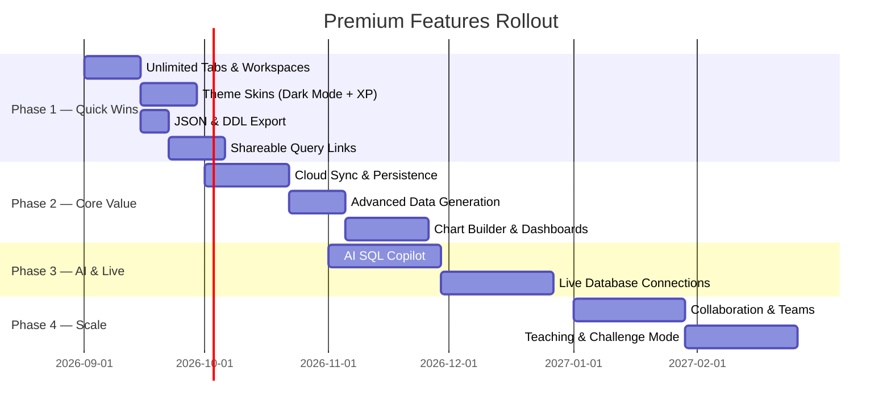

# ExNihilo 95 — Premium Features Plan

> **Philosophy:** The free tier should remain genuinely useful — a fully functional SQL playground. Premium unlocks **power-user workflows, collaboration, persistence, and AI intelligence** that transform ExNihilo from a playground into a professional tool.

---

## 🆓 Free Tier (What Stays Free)

| Feature | Details |
|---------|---------|
| Core SQL Engine | Full AST parsing, schema inference, synthetic data generation |
| 4 Dialect Support | MySQL, PostgreSQL, SQLite, SSMS |
| Up to 3 Query Tabs | Multi-tab workspace with independent state |
| Basic Syntax Highlighting | Green strings, purple numbers, navy keywords |
| Schema Tree Explorer | View inferred tables, columns, and foreign keys |
| Single-Session Results | Results persist until browser refresh |
| CSV Export | Export query results to CSV |
| Help Guide & Tour | Full documentation and guided walkthrough |
| Boot Animation & Win95 Theme | The complete retro aesthetic |

---

## 💎 Premium Tier — **ExNihilo 95 Pro**

### 🗂️ 1. Unlimited Query Tabs & Workspaces

| Feature | Free | Pro |
|---------|:----:|:---:|
| Query Tabs | 3 max | **Unlimited** |
| Named Workspaces | ✗ | **Save & switch between named workspaces** (e.g., "E-Commerce Project", "Analytics Sandbox") |
| Tab Grouping | ✗ | **Color-coded tab groups** with drag-to-reorder |
| Tab Pinning | ✗ | **Pin critical tabs** so they can't be accidentally closed |

---

### 💾 2. Persistent Sessions & Cloud Sync

| Feature | Description |
|---------|-------------|
| **Auto-Save to Cloud** | All queries, results, and schemas persist across sessions — never lose work on browser close |
| **Query History Timeline** | Scrollable timeline of every query ever executed with timestamps, execution time, and row counts |
| **Version History per Tab** | Git-style versioning — revert any tab to a previous state with diff view |
| **Cross-Device Sync** | Sign in with GitHub/Google and access your workspace from any machine |
| **Offline Mode** | Service worker caches your workspace for offline use; syncs when reconnected |

---

### 🤖 3. AI-Powered SQL Assistant (Copilot)

| Feature | Description |
|---------|-------------|
| **Natural Language → SQL** | Type "show me top 5 customers by revenue" and get the SQL generated instantly |
| **AI Query Autocomplete** | Context-aware suggestions as you type — knows your inferred schema |
| **Explain This Query** | Highlight any SQL and get a plain-English breakdown of what it does |
| **AI Error Fix Suggestions** | When a query fails, AI suggests the corrected version with reasoning |
| **Query Optimization Tips** | AI analyzes your query and suggests index hints, restructuring, or more efficient patterns |
| **Schema Story** | AI generates a narrative description of your inferred data model ("This looks like an e-commerce system with users, orders, and products...") |

---

### 📊 4. Advanced Data Visualization

| Feature | Description |
|---------|-------------|
| **Built-in Chart Builder** | Bar, line, pie, scatter, heatmap charts generated directly from query results |
| **Auto-Suggest Visualizations** | Engine detects aggregation patterns and suggests the best chart type |
| **Dashboard Mode** | Pin multiple query result charts to a single dashboard view |
| **Chart Export** | Export charts as PNG, SVG, or interactive HTML embeds |
| **Pivot Table View** | Drag-and-drop pivot table transformation on result grids |

---

### 🎲 5. Advanced Data Generation Controls

| Feature | Free | Pro |
|---------|:----:|:---:|
| Rows per Table | 20 max | **Up to 10,000 rows** |
| Table Cap | 25 max | **Unlimited tables** |
| **Custom Data Profiles** | ✗ | Define column-level data rules (e.g., "email must end with @company.com", "age between 18-65") |
| **Seed Data Upload** | ✗ | Upload a CSV/JSON and ExNihilo merges it with inferred schemas |
| **Deterministic Seeding** | ✗ | Set a seed number for reproducible data across sessions |
| **Realistic Data Packs** | ✗ | Pre-built data profiles: Healthcare, Finance, E-Commerce, SaaS, Gaming |
| **Locale-Aware Generation** | ✗ | Names, addresses, phone numbers matching selected locale (US, UK, India, Japan, etc.) |

---

### 🔗 6. Real Database Connections (Live Mode)

| Feature | Description |
|---------|-------------|
| **Connect to Live Databases** | MySQL, PostgreSQL, SQLite file, SQL Server via secure proxy |
| **Schema Import** | Import real schemas and run ExNihilo's synthetic data against them |
| **Query Against Real Data** | Toggle between synthetic and live data with one click |
| **Connection Profiles** | Save multiple database connections with encrypted credentials |
| **Read-Only Safety Mode** | Enforced read-only connections to prevent accidental writes |

> [!CAUTION]
> This is the highest-value premium feature — it transforms ExNihilo from a sandbox into a real SQL client.

---

### 📤 7. Advanced Export & Sharing

| Feature | Free | Pro |
|---------|:----:|:---:|
| CSV Export | ✓ | ✓ |
| **JSON Export** | ✗ | ✓ |
| **SQL INSERT Statements** | ✗ | Export inferred data as executable INSERT scripts |
| **Schema as DDL** | ✗ | Export inferred schemas as CREATE TABLE DDL for any dialect |
| **Shareable Query Links** | ✗ | Generate a unique URL that recreates your exact query + schema + results |
| **Embed Mode** | ✗ | Embeddable `<iframe>` widget for blogs, docs, and tutorials |
| **PDF Report** | ✗ | Export query + results + chart as a formatted PDF report |

---

### 🎨 8. Theme Customization & Skins

| Feature | Description |
|---------|-------------|
| **Windows 98 Theme** | Sleeker gradients, smoother buttons |
| **Windows XP Luna Theme** | Blue and green XP aesthetic with Bliss wallpaper |
| **Windows 2000 Professional** | Corporate gray minimalism |
| **Dark Mode (Win95 Noir)** | Full dark theme with neon syntax highlighting |
| **Custom Color Schemes** | User-defined color palette for syntax highlighting |
| **Custom Wallpapers** | Upload your own desktop wallpaper |
| **CRT Scanline Filter** | Optional retro CRT monitor overlay effect |
| **Sound Effects Pack** | Authentic Win95 startup chime, error sounds, and click effects |

---

### 👥 9. Collaboration & Teams

| Feature | Description |
|---------|-------------|
| **Shared Workspaces** | Invite team members to a shared query workspace |
| **Real-Time Collaboration** | Google Docs-style simultaneous editing with cursors |
| **Query Comments & Annotations** | Add inline comments to specific queries or result rows |
| **Team Query Library** | Shared repository of saved queries with tags and search |
| **Activity Feed** | See who ran what query and when |
| **Role-Based Access** | Admin, Editor, Viewer roles for team workspaces |

---

### 🧪 10. Teaching & Learning Mode

| Feature | Description |
|---------|-------------|
| **SQL Challenge Mode** | Built-in SQL puzzles with progressive difficulty (Easy → Expert) |
| **Guided Lessons** | Step-by-step SQL tutorials that run inside the IDE |
| **Student Progress Tracking** | Teachers can assign challenges and track student completion |
| **Classroom Mode** | Instructor broadcasts their screen; students follow along in their own IDE |
| **Certificate Generation** | Completion certificates for SQL courses |

---

## 💰 Suggested Pricing Tiers

| Tier | Price | Target Audience |
|------|-------|-----------------|
| **Free** | $0 | Students, hobbyists, quick SQL experimentation |
| **Pro** | $9/month | Individual developers, freelancers, power users |
| **Team** | $19/user/month | Small teams, startups, dev squads |
| **Education** | $4/student/month | Schools, bootcamps, universities (bulk pricing) |
| **Enterprise** | Custom | Companies needing SSO, audit logs, live DB connections, on-prem |

---

## 🚀 Recommended Premium Launch Roadmap

---

## 🔑 Conversion Strategy — Free → Premium Nudges

| Trigger | Nudge |
|---------|-------|
| User opens 4th tab | "Upgrade to Pro for unlimited tabs 💎" |
| User exports CSV 3+ times | "Unlock JSON, DDL, and shareable links with Pro" |
| User writes a complex query (CTE/Window) | "Pro tip: AI Copilot can explain and optimize this query" |
| User refreshes and loses work | "Never lose queries again — Pro auto-saves to the cloud ☁️" |
| User tries to change theme | "Unlock Dark Mode, XP Luna, and custom skins with Pro 🎨" |
| Query returns error | "Pro users get AI-powered fix suggestions for errors like this 🤖" |
| 7th session in a week | "You're a power user! Unlock your full potential with Pro" |

> [!TIP]
> The most effective conversion trigger is **data loss anxiety** — when a user refreshes and loses their queries, offering cloud persistence is the highest-converting upsell moment.

---

## 📝 Summary

The premium strategy splits into **3 value pillars**:

1. **Productivity** — Unlimited tabs, persistence, cloud sync, advanced exports
2. **Intelligence** — AI copilot, auto-visualization, optimization suggestions  
3. **Scale** — Live databases, collaboration, teaching mode, teams

The free tier remains a fully functional, impressive SQL playground that showcases the core innovation (zero-config schema inference). Premium extends it into a tool people **depend on daily** for real work.
