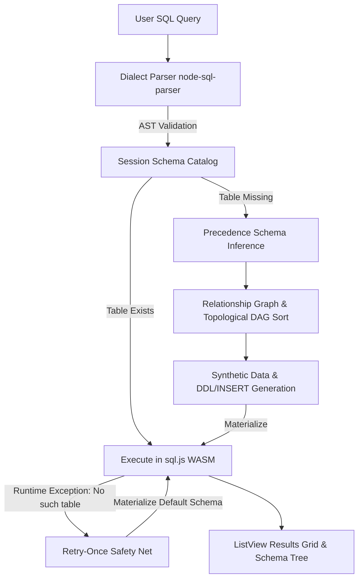

# 🗄️ ExNihilo 95 — Zero-Config In-Browser SQL IDE

[](https://exnihilo-95.vercel.app)
[](LICENSE)
[](COPYRIGHT_AND_INTELLECTUAL_PROPERTY.md)
[](https://nextjs.org/)
[](https://sql.js.org/)
[](https://github.com/Mrityunjai-hue)
[](https://n8n-ds-community.netlify.app/)
[](#-calling-all-builders--contributors-wanted)
[](PREMIUM_FEATURES.md)

> **The SQL database environment with ZERO "Table not found" errors.**  
> Built in the authentic nostalgic aesthetic of **Windows 95**, ExNihilo dynamically parses your SQL query's AST, automatically deduces column data types, maps foreign key relationships, synthesizes realistic test data on the fly, and executes queries entirely inside your browser via WebAssembly.
>
> 🌐 **Try it Live in Browser:** **[https://exnihilo-95.vercel.app](https://exnihilo-95.vercel.app)**

---

## 💡 Original Idea — Made with AI

> **"I, Mrityunjai ([@Mrityunjai-hue](https://github.com/Mrityunjai-hue)), claim that this is the original idea of mine, but I have made it with AI."**

### 🤖 AI Tools & Technologies Used
- **Google Antigravity & Gemini**: Autonomous pair programming, architectural design, AST visitor implementation, multi-phase headless test harnesses, and Windows 95 UI integration.
- **Node SQL Parser**: AST parser configured across 4 major SQL dialects (MySQL, PostgreSQL, SQLite, SSMS / Transact-SQL).
- **Faker.js Synthetic Data Engine**: Heuristic-driven realistic mock data generation (names, emails, prices, timestamps, addresses).
- **sql.js (WebAssembly SQLite 3.49.1)**: Full in-browser relational execution engine supporting `INNER`, `LEFT`, `RIGHT`, and `FULL OUTER` joins.

---

## ⚖️ Copyright, Intellectual Property & Anti-Theft Notice

> **Protection of Original Authorship & Brand Integrity**

ExNihilo 95 is an open-source project created by **Mrityunjai ([@Mrityunjai-hue](https://github.com/Mrityunjai-hue))**. While legitimate forks, contributions, and educational exploration are encouraged, **plagiarism, deceptive re-branding, and attribution removal are strictly prohibited**.

- 🔴 **No Plagiarism or False Claims:** You may not claim the concept, architecture, or codebase as your own original creation.
- 🔴 **Mandatory Credit & Link:** Any deployment, fork, or derivative work **MUST** retain visible attribution to Mrityunjai and link to the official repository ([https://github.com/Mrityunjai-hue/exnihilo-95](https://github.com/Mrityunjai-hue/exnihilo-95)).
- 🔴 **Legal Enforcement & DMCA Takedowns:** Removing author notices, stripping credits, or re-publishing this application under a false author name will result in immediate **DMCA takedown demands**, repository reporting to GitHub Trust & Safety, and legal enforcement.

👉 **Read the full legal notice:** **[COPYRIGHT_AND_INTELLECTUAL_PROPERTY.md](COPYRIGHT_AND_INTELLECTUAL_PROPERTY.md)**

---

## 🎯 Who is ExNihilo 95 Built For?

> **Eliminating environment setup friction for students, recruiters, educators, and developers worldwide.**

| Persona | Why ExNihilo 95 is a Must-Use Tool |
|---------|-----------------------------------|
| 🎓 **Students & Self-Learners** | Practice writing SQL queries instantly with zero database installation, server setup, or dataset imports. |
| 💼 **Recruiters & Interviewers** | Conduct live candidate SQL coding tests on the spot without setting up test database instances or dummy tables. |
| 🏫 **Educators & CS Teachers** | Demonstrate complex SQL concepts (JOINs, CTEs, Window Functions) live in class with zero setup friction. |
| 👨‍💻 **Software Developers & DBAs** | Prototype and dry-run query logic before writing production database migrations or creating staging tables. |
| 🧪 **QA & Data Analysts** | Test query edge-cases and referential integrity against auto-synthesized relational data on demand. |

---

## 🌐 Community Partnership
ExNihilo 95 is proudly powered by the **[N8N Data Science Community](https://n8n-ds-community.netlify.app/)** using AI.  
Join the community for AI tools, automation workflows, tutorials, and data science discussions!

---

## 📢 Calling All Builders — Contributors Wanted!

> **ExNihilo 95 has proven its core concept. Now it's time to scale it into something massive — and we need YOU.**

I've laid out a comprehensive **[Premium Features Roadmap](PREMIUM_FEATURES.md)** with 10 major feature categories that will transform ExNihilo from a playground into a professional-grade SQL platform. This is too big for one person — it needs a **team of passionate builders**.

### 🏗️ What We're Building Next

| Feature | Description | Skills Needed |
|---------|-------------|:--------------|
| 🤖 **AI SQL Copilot** | Natural language → SQL, query explanations, error fix suggestions | AI/ML, LLM APIs |
| 💾 **Cloud Sync & Persistence** | Auto-save queries, cross-device sync, version history | Backend, Auth, DB |
| 📊 **Chart Builder & Dashboards** | Bar/line/pie/scatter charts from query results | React, D3/Chart.js |
| 🔗 **Live Database Connections** | Connect to real MySQL/PostgreSQL/SQLite databases | Backend, Security |
| 🎨 **Theme Engine** | Win98, XP Luna, Dark Mode, custom skins | CSS, Design |
| 👥 **Real-Time Collaboration** | Google Docs-style shared editing with team workspaces | WebSockets, CRDT |
| 🧪 **SQL Challenge Mode** | Built-in puzzles & guided lessons for learning SQL | Content, Frontend |
| 📤 **Advanced Exports** | DDL scripts, shareable links, embeddable widgets, PDF reports | Frontend, Backend |
| 🎲 **Smart Data Generation** | Locale-aware data, custom profiles, seed data upload | Data Engineering |
| 🎓 **Teaching & Classroom Mode** | Instructor broadcasts, student tracking, certificates | Full-Stack |

### 🎯 Who We're Looking For

- **Frontend Engineers** (React / Next.js / TypeScript) — UI components, visualization, theming
- **Backend Engineers** — Authentication, cloud infrastructure, database proxies
- **AI/ML Engineers** — NL-to-SQL, query optimization, intelligent autocomplete
- **Designers** — Theme skins, UX flows, data visualization design
- **Content Creators** — SQL tutorials, challenge puzzles, documentation
- **Community Builders** — Developer relations, outreach, onboarding

### 🚀 How to Contribute

1. **Read the full roadmap:** **[PREMIUM_FEATURES.md](PREMIUM_FEATURES.md)**
2. **Read the contributing guide:** **[CONTRIBUTING.md](CONTRIBUTING.md)**
3. **Fork the repo**, pick a feature, and submit a PR
4. **Star ⭐ the repo** to show your support and help others discover it

> **Top contributors will be credited as co-creators and core team members.** Let's build the future of SQL tooling together. 🚀

---

## ✨ Key Features

- ⚡ **Zero Table Setup:** Type queries against tables that don't exist yet — ExNihilo infers schema and creates them on the fly.
- 🎛️ **Multi-Dialect Support:** Natively parses **MySQL**, **PostgreSQL** (with `::type` casting & `WITH` CTEs), **SQLite**, and **SSMS** (Transact-SQL with bracket identifiers `[dbo].[table]`).
- 🔗 **Referential Integrity & Foreign Keys:** Discovers foreign key relationships and topologically sorts table creation (Kahn's DAG algorithm) so child tables sample valid IDs from parent primary key pools.
- 🌳 **Self-Joins & Hierarchies:** Handles recursive relationships (e.g. `employees.manager_id = employees.id`) with top-level `NULL` roots.
- 💾 **Session Schema Catalog & Caching:** Inferred tables persist in memory so repeat queries run instantly without re-generation.
- 🛡️ **Retry-Once Safety Net:** Intercepts unanticipated missing tables at runtime, materializes default starter schemas, and retries queries seamlessly.
- 🗂️ **Multi-Tab Query Workspace:** Open unlimited query tabs (`Ctrl+T`), each with independent editor state, results, and execution metrics.
- ✂️ **Selection-Aware Execution:** Highlight any SQL block to run only that selection; semicolon-delimited queries return multiple result tabs.
- 📂 **Cascading Win95 Menus:** Authentic `File`, `Edit`, `Query`, `View`, `Tools`, `Help` dropdown menus with keyboard shortcuts and 1-click sample query insertion.
- 🎨 **Color-Coded Syntax Highlighting:** Green strings, purple numbers, crimson operators, navy keywords for maximum readability.
- 🖥️ **Authentic Windows 95 Desktop & Draggable Windows:**
  - Classic teal desktop (`#008080`) with 3D extruded centerpiece wallpaper.
  - Freely draggable and repositionable windows (SQL Studio, Setup Wizard, Help Guide, Settings).
  - Authentic Start menu with vertical blue banner, running taskbar tabs, and digital clock.
  - Windows 95 Help Manual (`winhlp32.exe`) featuring interactive SQL query tutorials with **"👉 Try this query in IDE"** buttons.
  - CodeMirror 6 query editor with SQL keyword syntax highlighting and `F5` / `Ctrl+Enter` execution shortcuts.

---

## 🏗️ Architecture & Pipeline



### Schema Inference Precedence Order
1. **P6 (Highest):** Explicit `CAST()` or PostgreSQL `::type`
2. **P5:** Typed literals (`'2026-08-20'` -> `DATE`, `3.14` -> `NUMERIC`, `true` -> `BOOLEAN`)
3. **P4:** Functions & Aggregates (`AVG(salary)` -> `NUMERIC`, `LIKE '%@%'` -> `VARCHAR`)
4. **P3:** `GROUP BY` grouping columns (`department` -> `VARCHAR`)
5. **P2:** Naming heuristics (`is_active` -> `BOOLEAN`, `*_at` -> `DATE`, `*_id` -> `INTEGER`)
6. **P1 (Fallback):** `VARCHAR(255)`

---

## 🧪 Acceptance Test Suite (14 / 14 Passed)

ExNihilo has been validated end-to-end against the complete 14-query acceptance specification:

| # | Dialect | Acceptance Query | Status |
|---|---|---|:---:|
| 1 | MySQL | `SELECT * FROM customers WHERE age > 30` | ✅ PASS |
| 2 | PostgreSQL | `SELECT name, email FROM users WHERE email LIKE '%@gmail.com'` | ✅ PASS |
| 3 | MySQL | `SELECT o.id, c.name FROM orders o INNER JOIN customers c ON o.customer_id = c.id WHERE c.age > 25` | ✅ PASS |
| 4 | MySQL | `SELECT department, AVG(salary) FROM employees GROUP BY department` | ✅ PASS |
| 5 | MySQL | `SELECT name FROM employees e JOIN departments d ON e.dept_id = d.id` (Ambiguous Column) | ✅ PASS (Surfaced Error) |
| 6 | SQLite | `SELECT * FROM orderz` (Default Starter Schema + Cache Hit) | ✅ PASS |
| 7 | SQLite | `SELECT * FROM prders LIMIT` (Malformed Syntax Error) | ✅ PASS (Surfaced Syntax Error) |
| 8 | PostgreSQL | `SELECT u.name, o.total FROM users u JOIN orders o ON u.id = o.user_id WHERE o.total > 100` | ✅ PASS |
| 9 | PostgreSQL | `SELECT e.name AS employee, m.name AS manager FROM employees e LEFT JOIN employees m ON e.manager_id = m.id` | ✅ PASS |
| 10 | MySQL | `SELECT c.name, o.id, p.name FROM customers c JOIN orders o ... JOIN order_items oi ... JOIN products p` | ✅ PASS |
| 11 | SQLite | `SELECT c.name, o.id FROM customers c LEFT JOIN orders o ON c.id = o.customer_id` | ✅ PASS |
| 12 | MySQL | `SELECT * FROM Foo` (Lowercase Normalization) | ✅ PASS |
| 13 | SQLite | `SELECT * FROM widgets;` (Semicolon & Bare Table) | ✅ PASS |
| 14 | PostgreSQL | `WITH recent AS (SELECT * FROM sales WHERE sale_date > '2026-01-01') SELECT * FROM recent` | ✅ PASS |

---

## 🚀 Getting Started

### 🌐 Instant Web Access
No installation required — launch the full application in your browser:  
👉 **[https://exnihilo-95.vercel.app](https://exnihilo-95.vercel.app)**

### 💻 Local Installation & Run

1. Clone the repository:
   ```bash
   git clone https://github.com/Mrityunjai-hue/exnihilo-95.git
   cd exnihilo-95
   ```

2. Install dependencies:
   ```bash
   npm install
   ```

3. Start the local development server:
   ```bash
   npm run dev
   ```

4. Open [http://localhost:3000](http://localhost:3000) in your browser.

---

## 📦 Scripts

- `npm run dev` — Launches Next.js Turbopack development server on `localhost:3000`.
- `npm run build` — Creates an optimized production static bundle.
- `npm start` — Starts the production server.
- `node phase6_full_suite.cjs` — Executes the full 14-query headless verification harness.

---

## 📄 License & Attribution

- **Creator:** [Mrityunjai](https://github.com/Mrityunjai-hue)
- **Community:** [N8N Data Science Community](https://n8n-ds-community.netlify.app/)
- **License:** MIT License
- **Contributing:** [CONTRIBUTING.md](CONTRIBUTING.md) — Read this to get started as a contributor
- **Premium Roadmap:** [PREMIUM_FEATURES.md](PREMIUM_FEATURES.md) — Full feature plan for the next evolution of ExNihilo

