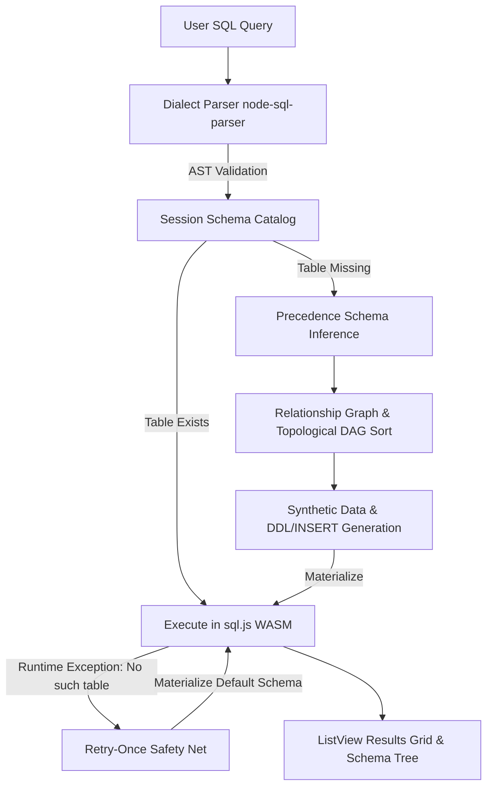

# 🗄️ ExNihilo 95 — Zero-Config In-Browser SQL IDE

[](https://exnihio-app.vercel.app)
[](LICENSE)
[](https://nextjs.org/)
[](https://sql.js.org/)
[](https://github.com/Mrityunjai-hue)
[](https://n8n-ds-community.netlify.app/)

> **The SQL database environment with ZERO "Table not found" errors.**  
> Built in the authentic nostalgic aesthetic of **Windows 95**, ExNihilo dynamically parses your SQL query's AST, automatically deduces column data types, maps foreign key relationships, synthesizes realistic test data on the fly, and executes queries entirely inside your browser via WebAssembly.

---

## 💡 Original Idea — Made with AI

> **"I, Mrityunjai ([@Mrityunjai-hue](https://github.com/Mrityunjai-hue)), claim that this is the original idea of mine, but I have made it with AI."**

### 🤖 AI Tools & Technologies Used
- **Google Antigravity & Gemini**: Autonomous pair programming, architectural design, AST visitor implementation, multi-phase headless test harnesses, and Windows 95 UI integration.
- **Node SQL Parser**: AST parser configured across 4 major SQL dialects (MySQL, PostgreSQL, SQLite, SSMS / Transact-SQL).
- **Faker.js Synthetic Data Engine**: Heuristic-driven realistic mock data generation (names, emails, prices, timestamps, addresses).
- **sql.js (WebAssembly SQLite 3.49.1)**: Full in-browser relational execution engine supporting `INNER`, `LEFT`, `RIGHT`, and `FULL OUTER` joins.

---

## 🌐 Community Partnership
ExNihilo 95 is proudly powered by the **[N8N Data Science Community](https://n8n-ds-community.netlify.app/)** using AI.  
Join the community for AI tools, automation workflows, tutorials, and data science discussions!

---

## ✨ Key Features

- ⚡ **Zero Table Setup:** Type queries against tables that don't exist yet — ExNihilo infers schema and creates them on the fly.
- 🎛️ **Multi-Dialect Support:** Natively parses **MySQL**, **PostgreSQL** (with `::type` casting & `WITH` CTEs), **SQLite**, and **SSMS** (Transact-SQL with bracket identifiers `[dbo].[table]`).
- 🔗 **Referential Integrity & Foreign Keys:** Discovers foreign key relationships and topologically sorts table creation (Kahn's DAG algorithm) so child tables sample valid IDs from parent primary key pools.
- 🌳 **Self-Joins & Hierarchies:** Handles recursive relationships (e.g. `employees.manager_id = employees.id`) with top-level `NULL` roots.
- 💾 **Session Schema Catalog & Caching:** Inferred tables persist in memory so repeat queries run instantly without re-generation.
- 🛡️ **Retry-Once Safety Net:** Intercepts unanticipated missing tables at runtime, materializes default starter schemas, and retries queries seamlessly.
- 🖥️ **Authentic Windows 95 Desktop & Draggable Windows:**
  - Classic teal desktop (`#008080`) with 3D extruded centerpiece wallpaper.
  - Freely draggable and repositionable windows (SQL Studio, Setup Wizard, Help Guide, Settings).
  - Authentic Start menu with vertical blue banner, running taskbar tabs, and digital clock.
  - Windows 95 Help Manual (`winhlp32.exe`) featuring interactive SQL query tutorials with **"👉 Try this query in IDE"** buttons.
  - CodeMirror 6 query editor with SQL keyword syntax highlighting and `F5` / `Ctrl+Enter` execution shortcuts.

---

## 🏗️ Architecture & Pipeline



### Schema Inference Precedence Order
1. **P6 (Highest):** Explicit `CAST()` or PostgreSQL `::type`
2. **P5:** Typed literals (`'2026-08-20'` -> `DATE`, `3.14` -> `NUMERIC`, `true` -> `BOOLEAN`)
3. **P4:** Functions & Aggregates (`AVG(salary)` -> `NUMERIC`, `LIKE '%@%'` -> `VARCHAR`)
4. **P3:** `GROUP BY` grouping columns (`department` -> `VARCHAR`)
5. **P2:** Naming heuristics (`is_active` -> `BOOLEAN`, `*_at` -> `DATE`, `*_id` -> `INTEGER`)
6. **P1 (Fallback):** `VARCHAR(255)`

---

## 🧪 Acceptance Test Suite (14 / 14 Passed)

ExNihilo has been validated end-to-end against the complete 14-query acceptance specification:

| # | Dialect | Acceptance Query | Status |
|---|---|---|:---:|
| 1 | MySQL | `SELECT * FROM customers WHERE age > 30` | ✅ PASS |
| 2 | PostgreSQL | `SELECT name, email FROM users WHERE email LIKE '%@gmail.com'` | ✅ PASS |
| 3 | MySQL | `SELECT o.id, c.name FROM orders o INNER JOIN customers c ON o.customer_id = c.id WHERE c.age > 25` | ✅ PASS |
| 4 | MySQL | `SELECT department, AVG(salary) FROM employees GROUP BY department` | ✅ PASS |
| 5 | MySQL | `SELECT name FROM employees e JOIN departments d ON e.dept_id = d.id` (Ambiguous Column) | ✅ PASS (Surfaced Error) |
| 6 | SQLite | `SELECT * FROM orderz` (Default Starter Schema + Cache Hit) | ✅ PASS |
| 7 | SQLite | `SELECT * FROM prders LIMIT` (Malformed Syntax Error) | ✅ PASS (Surfaced Syntax Error) |
| 8 | PostgreSQL | `SELECT u.name, o.total FROM users u JOIN orders o ON u.id = o.user_id WHERE o.total > 100` | ✅ PASS |
| 9 | PostgreSQL | `SELECT e.name AS employee, m.name AS manager FROM employees e LEFT JOIN employees m ON e.manager_id = m.id` | ✅ PASS |
| 10 | MySQL | `SELECT c.name, o.id, p.name FROM customers c JOIN orders o ... JOIN order_items oi ... JOIN products p` | ✅ PASS |
| 11 | SQLite | `SELECT c.name, o.id FROM customers c LEFT JOIN orders o ON c.id = o.customer_id` | ✅ PASS |
| 12 | MySQL | `SELECT * FROM Foo` (Lowercase Normalization) | ✅ PASS |
| 13 | SQLite | `SELECT * FROM widgets;` (Semicolon & Bare Table) | ✅ PASS |
| 14 | PostgreSQL | `WITH recent AS (SELECT * FROM sales WHERE sale_date > '2026-01-01') SELECT * FROM recent` | ✅ PASS |

---

## 🚀 Getting Started

### Prerequisites
- [Node.js](https://nodejs.org/) (v18 or higher)
- [npm](https://www.npmjs.com/)

### Installation & Run

1. Clone the repository:
   ```bash
   git clone https://github.com/Mrityunjai-hue/exnihilo-95.git
   cd exnihilo-95
   ```

2. Install dependencies:
   ```bash
   npm install
   ```

3. Start the local development server:
   ```bash
   npm run dev
   ```

4. Open [http://localhost:3000](http://localhost:3000) in your browser.

---

## 📦 Scripts

- `npm run dev` — Launches Next.js Turbopack development server on `localhost:3000`.
- `npm run build` — Creates an optimized production static bundle.
- `npm start` — Starts the production server.
- `node phase6_full_suite.cjs` — Executes the full 14-query headless verification harness.

---

## 📄 License & Attribution

- **Creator:** [Mrityunjai](https://github.com/Mrityunjai-hue)
- **Community:** [N8N Data Science Community](https://n8n-ds-community.netlify.app/)
- **License:** MIT License
