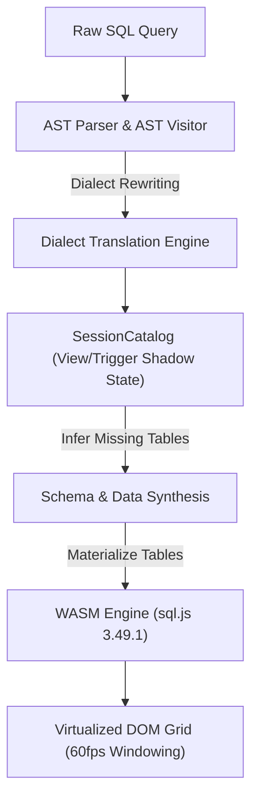

# 🗄️ ExNihilo 95 — Zero-Config In-Browser SQL IDE


[](https://github.com/Mrityunjai-hue/exnihilo-95)
[](https://github.com/Mrityunjai-hue/exnihilo-95)
[](https://github.com/Mrityunjai-hue/exnihilo-95)
[](https://github.com/Mrityunjai-hue/exnihilo-95)
[](https://exnihilo-95.vercel.app)
[](LICENSE)
[](COPYRIGHT_AND_INTELLECTUAL_PROPERTY.md)
[](https://nextjs.org/)
[](https://sql.js.org/)
[](https://github.com/Mrityunjai-hue)
[](https://n8n-ds-community.netlify.app/)

> **The SQL database environment with ZERO "Table not found" errors.**  
> Built in the authentic nostalgic aesthetic of **Windows 95**, ExNihilo dynamically parses your SQL query's AST, automatically deduces column data types, maps foreign key relationships, synthesizes realistic test data on the fly, and executes queries entirely inside your browser via WebAssembly.
>
> 🌐 **Try it Live in Browser:** **[https://exnihilo-95.vercel.app](https://exnihilo-95.vercel.app)**

---

## 💡 Original Idea — Made with AI

> **"I, Mrityunjai ([@Mrityunjai-hue](https://github.com/Mrityunjai-hue)), claim that this is the original idea of mine, but I have made it with AI."**

### 🤖 AI Tools & Technologies Used
- **Google Antigravity & Gemini**: Autonomous pair programming, architectural design, AST visitor implementation, multi-phase headless test harnesses, and Windows 95 UI integration.
- **Node SQL Parser**: AST parser configured across 4 major SQL dialects (MySQL, PostgreSQL, SQLite, SSMS / Transact-SQL).
- **Faker.js Synthetic Data Engine**: Heuristic-driven realistic mock data generation (names, emails, prices, timestamps, addresses).
- **sql.js (WebAssembly SQLite 3.49.1)**: Full in-browser relational execution engine supporting `INNER`, `LEFT`, `RIGHT`, `FULL OUTER` joins, `WITH RECURSIVE` CTEs, and `CREATE TRIGGER` native event handling.

---

## ⚖️ Copyright, Intellectual Property & Anti-Theft Notice

> **Protection of Original Authorship & Brand Integrity**

ExNihilo 95 is an open-source project created by **Mrityunjai ([@Mrityunjai-hue](https://github.com/Mrityunjai-hue))**. While legitimate forks, contributions, and educational exploration are encouraged, **plagiarism, deceptive re-branding, and attribution removal are strictly prohibited**.

- 🔴 **No Plagiarism or False Claims:** You may not claim the concept, architecture, or codebase as your own original creation.
- 🔴 **Mandatory Credit & Link:** Any deployment, fork, or derivative work **MUST** retain visible attribution to Mrityunjai and link to the official repository ([https://github.com/Mrityunjai-hue/exnihilo-95](https://github.com/Mrityunjai-hue/exnihilo-95)).
- 🔴 **Legal Enforcement & DMCA Takedowns:** Removing author notices, stripping credits, or re-publishing this application under a false author name will result in immediate **DMCA takedown demands**, repository reporting to GitHub Trust & Safety, and legal enforcement.

👉 **Read the full legal notice:** **[COPYRIGHT_AND_INTELLECTUAL_PROPERTY.md](COPYRIGHT_AND_INTELLECTUAL_PROPERTY.md)**

---

## 🏗️ Architecture

ExNihilo 95 implements a hybrid execution pipeline that decouples SQL compilation, AST schema inference, virtualized session state, and WebAssembly engine execution.

### Query Execution Lifecycle



### 1. AST Parser & Rewriter Engine
- **Multi-Dialect Normalization**: Uses `node-sql-parser` to parse incoming SQL strings into Abstract Syntax Trees (ASTs).
- **Dialect Rewriting**: Normalizes dialect-specific aggregation functions and type casts prior to WASM execution:
  - Rewrites PostgreSQL `STRING_AGG(col, delimiter)` and SQLite `group_concat(col, delimiter)` into standardized `GROUP_CONCAT()` calls.
  - Normalizes PostgreSQL `::type` casting and SSMS bracketed identifiers (`[dbo].[users]`) into ANSI SQL standard identifier strings.
  - Rewrites Window Function specifications (`ROW_NUMBER() OVER (...)`) for WASM compatibility.

### 2. Hybrid Virtualization & SessionCatalog
- **Interception of DDL & Procedural Logic**: Rather than risking WASM engine panics on unsupported dialect features, `SessionCatalog` intercepts `CREATE VIEW` and `CREATE TRIGGER` statements into in-memory JS shadow states.
- **Shadow State Catalog**:
  - `CREATE VIEW`: Virtualized views are registered in `SessionCatalog` without duplicate physical data storage. View queries are evaluated on-the-fly against underlying tables.
  - `CREATE TRIGGER`: Triggers are stored in catalog registries and evaluated natively during `INSERT`/`UPDATE`/`DELETE` mutations.

---

## ⚡ Performance & State Isolation

### 1. IndexedDB Persistence & 500ms Debounced Sync
- **Bypassing the 5MB localStorage Boundary**: Modern browser `localStorage` enforces a strict 5MB limit. ExNihilo 95 uses a custom IndexedDB storage adapter (`useWorkspaceStorage`) supporting multi-megabyte database states, query history logs, and multiple script tabs.
- **500ms Debounced Synchronization**: State mutations (tab edits, query history additions) are buffered and debounced to IndexedDB every 500ms to eliminate UI thread blocking during active typing.

### 2. DOM Virtualization ($24\text{px}$ Windowing System)
- **60fps Large Data Grid Rendering**: Rendering 10,000+ data rows as standard DOM nodes causes severe browser frame drops. ExNihilo 95 implements a fixed-height windowing system ($24\text{px}$ row height with an overscan buffer).
- **Constant-Time DOM Footprint**: Only rows visible in the viewport ($\sim 25\text{--}35$ nodes) are rendered at any moment, maintaining 60fps performance regardless of result set size.

### 3. ReDoS Immunity
- **Safe Filtering for Large Payloads**: High-frequency grid search filters migrated from Regular Expressions to `.includes()` substring matching. This eliminates Regular Expression Denial of Service (ReDoS) vulnerability vectors when searching multi-thousand-row payloads.

---

## 🎯 SQL Dialect Support Matrix

ExNihilo 95 provides full parsing and execution support across 4 major SQL dialects:

| Feature / Command | MySQL | PostgreSQL | SQLite | T-SQL (SSMS) |
| :--- | :---: | :---: | :---: | :---: |
| `SELECT` / `WHERE` / `ORDER BY` | ✓ | ✓ | ✓ | ✓ |
| `INNER JOIN` / `LEFT JOIN` / `RIGHT JOIN` | ✓ | ✓ | ✓ | ✓ |
| `FULL OUTER JOIN` | ✓ | ✓ | ✓ | ✓ |
| `GROUP BY` / `HAVING` | ✓ | ✓ | ✓ | ✓ |
| `GROUP_CONCAT()` / `STRING_AGG()` | ✓ | ✓ | ✓ | ✓ |
| `ROW_NUMBER()`, `RANK()`, `DENSE_RANK()` | ✓ | ✓ | ✓ | ✓ |
| `LEAD()`, `LAG()`, `OVER (PARTITION BY)` | ✓ | ✓ | ✓ | ✓ |
| `WITH RECURSIVE` (CTE Traversal) | ✓ | ✓ | ✓ | ✓ |
| `TRUNCATE TABLE` | ✓ | ✓ | ✓ | ✓ |
| `CREATE DATABASE` / `CREATE SCHEMA` | ✓ | ✓ | ✓ | ✓ |
| `CREATE VIEW` (Virtualized) | ✓ | ✓ | ✓ | ✓ |
| `CREATE TRIGGER` | ✓ | ✓ | ✓ | ✓ |
| `CREATE PROCEDURE` / `CREATE FUNCTION` | ✓ | ✓ | ✓ | ✓ |

---

## 🎯 Who is ExNihilo 95 Built For?

> **Eliminating environment setup friction for students, recruiters, educators, and developers worldwide.**

| Persona | Why ExNihilo 95 is a Must-Use Tool |
|---------|-----------------------------------|
| 🎓 **Students & Self-Learners** | Practice writing SQL queries instantly with zero database installation, server setup, or dataset imports. |
| 💼 **Recruiters & Interviewers** | Conduct live candidate SQL coding tests on the spot without setting up test database instances or dummy tables. |
| 🏫 **Educators & CS Teachers** | Demonstrate complex SQL concepts (JOINs, CTEs, Window Functions) live in class with zero setup friction. |
| 👨‍💻 **Software Developers & DBAs** | Prototype and dry-run query logic before writing production database migrations or creating staging tables. |
| 🧪 **QA & Data Analysts** | Test query edge-cases and referential integrity against auto-synthesized relational data on demand. |

---

## 🌐 Community Partnership
ExNihilo 95 is proudly powered by the **[N8N Data Science Community](https://n8n-ds-community.netlify.app/)** using AI.  
Join the community for AI tools, automation workflows, tutorials, and data science discussions!

---

## 📢 Calling All Builders — Contributors Wanted!

> **ExNihilo 95 has proven its core concept. Now it's time to scale it into something massive — and we need YOU.**

I've laid out a comprehensive **[Premium Features Roadmap](PREMIUM_FEATURES.md)** with 10 major feature categories that will transform ExNihilo from a playground into a professional-grade SQL platform. This is too big for one person — it needs a **team of passionate builders**.

---

## 🚀 Getting Started

### Prerequisites
- **Node.js**: `v18.0.0` or higher
- **npm**: `v9.0.0` or higher (or `yarn` / `pnpm`)

### 1. Installation & Local Development

1. Clone the repository:
   ```bash
   git clone https://github.com/Mrityunjai-hue/exnihilo-95.git
   cd exnihilo-95
   ```

2. Install dependencies:
   ```bash
   npm install
   ```

3. Start the local development server:
   ```bash
   npm run dev
   ```

4. Open [http://localhost:3000](http://localhost:3000) in your browser.

---

## 🧪 Testing Suites & Validation

ExNihilo 95 enforces strict multi-layered testing validation across unit, end-to-end, and compilation suites:

```bash
# 1. Run Unit Test Suite (73/73 Passed)
npx vitest run

# 2. Run Playwright E2E Browser Test Suite (9/9 Passed)
npx playwright test

# 3. Next.js Production Build Validation (0 TypeScript Errors)
npm run build
```

| Suite | Command | Scope & Coverage | Status |
| :--- | :--- | :--- | :---: |
| **Vitest Unit** | `npx vitest run` | Validates AST extraction, schema inference, DDL, Window Functions, and Graph/CTE execution. | **73 / 73 Passed** |
| **Playwright E2E** | `npx playwright test` | Validates window drag isolation, IndexedDB state persistence, and retro UI lifecycle. | **9 / 9 Passed** |
| **TypeScript Build** | `npm run build` | Validates zero static type errors, Next.js page generation, and bundle optimization. | **0 Errors** |

---

## 📄 License & Attribution

- **Creator:** [Mrityunjai](https://github.com/Mrityunjai-hue)
- **Community:** [N8N Data Science Community](https://n8n-ds-community.netlify.app/)
- **License:** MIT License
- **Contributing:** [CONTRIBUTING.md](CONTRIBUTING.md) — Read this to get started as a contributor
- **Premium Roadmap:** [PREMIUM_FEATURES.md](PREMIUM_FEATURES.md) — Full feature plan for the next evolution of ExNihilo
