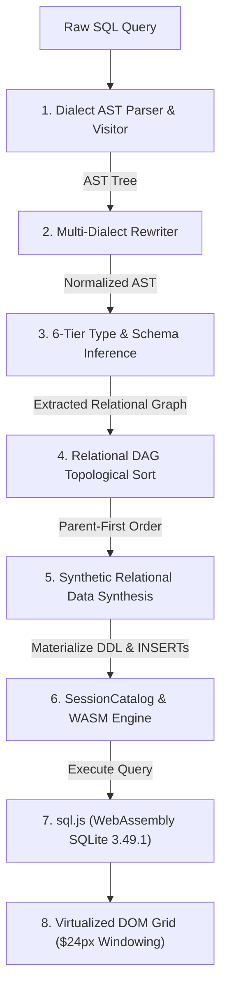
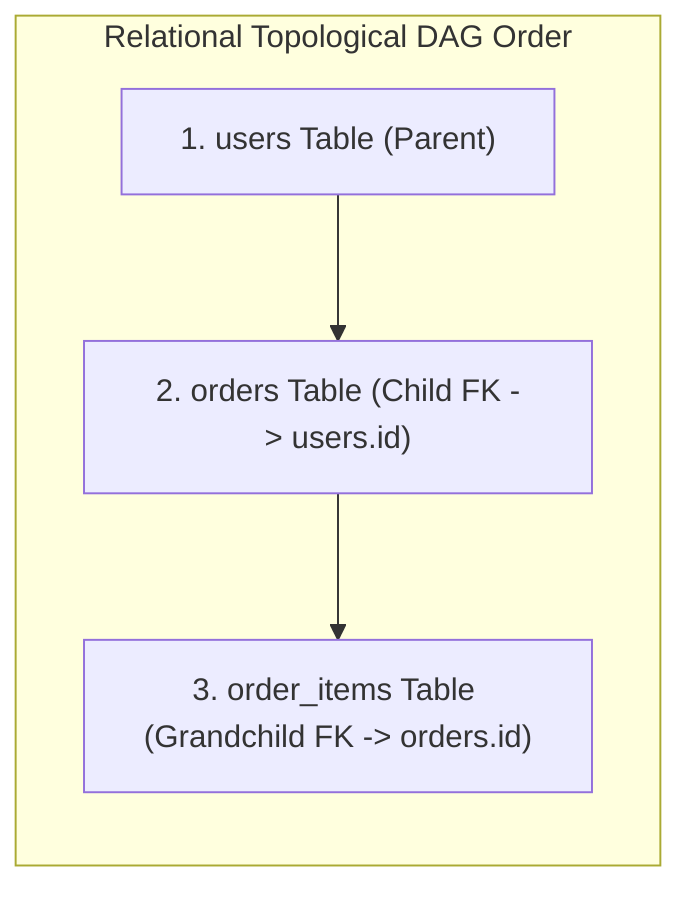

<p align="center">
  <h1 align="center">🗄️ ExNihilo 95 — Zero-Config In-Browser SQL IDE</h1>
  <p align="center">
    <strong>Run SQL queries instantly against non-existent tables without creating schemas or databases.</strong>
  </p>
</p>

<p align="center">
  <a href="https://exnihilo-95.vercel.app">
    
  </a>
</p>

<p align="center">
  <a href="https://github.com/Mrityunjai-hue/exnihilo-95"></a>
  <a href="https://github.com/Mrityunjai-hue/exnihilo-95"></a>
  <a href="https://github.com/Mrityunjai-hue/exnihilo-95"></a>
  <a href="https://github.com/Mrityunjai-hue/exnihilo-95"></a>
  <a href="https://exnihilo-95.vercel.app"></a>
  <a href="LICENSE"></a>
  <a href="COPYRIGHT_AND_INTELLECTUAL_PROPERTY.md"></a>
  <a href="https://nextjs.org/"></a>
  <a href="https://sql.js.org/"></a>
  <a href="https://n8n-ds-community.netlify.app/"></a>
</p>

> **The SQL database environment with ZERO "Table not found" errors.**  
> Built in the authentic nostalgic aesthetic of **Windows 95**, ExNihilo dynamically parses your SQL query's AST, automatically deduces column data types, maps foreign key relationships, synthesizes realistic test data on the fly, and executes queries entirely inside your browser via WebAssembly.
>
> 🌐 **Try it Live in Browser:** **[https://exnihilo-95.vercel.app](https://exnihilo-95.vercel.app)**
> 🎬 **Watch Full HD Demo Video:** **[public/demo/exnihilo_demo.mp4](public/demo/exnihilo_demo.mp4)**

---

## 📑 Table of Contents

- [💡 Original Idea & AI Stack](#-original-idea--made-with-ai)
- [⚖️ Copyright & Intellectual Property](#%EF%B8%8F-copyright-intellectual-property--anti-theft-notice)
- [🎬 Product Showcase & Interface](#-product-showcase--interface)
- [🧠 Deep Dive: How ExNihilo Understands & Synthesizes Queries](#-deep-dive-how-exnihilo-understands--synthesizes-queries)
  - [1. Query Execution & Synthesis Pipeline](#1-query-execution--synthesis-pipeline)
  - [2. AST Parsing & Multi-Dialect Rewriter](#2-ast-parsing--multi-dialect-rewriter)
  - [3. 6-Tier Schema & Type Inference Engine](#3-6-tier-schema--type-inference-engine)
  - [4. Relational DAG Dependency Resolution & Data Generation](#4-relational-dag-dependency-resolution--data-generation)
  - [5. Virtualized SessionCatalog (View & Trigger Interception)](#5-virtualized-sessioncatalog-view--trigger-interception)
- [⚡ Performance & State Isolation](#-performance--state-isolation)
- [🎯 SQL Dialect Command Matrix](#-sql-dialect-support-matrix)
- [🎯 Who is ExNihilo 95 Built For?](#-who-is-exnihilo-95-built-for)
- [🚀 Getting Started & Testing Suites](#-getting-started)
- [🎛️ Windows 95 Controls & Shortcuts](#%EF%B8%8F-windows-95-desktop-controls--keyboard-shortcuts)
- [📄 License & Attribution](#-license--attribution)

---

## 💡 Original Idea — Made with AI

> **"I, Mrityunjai ([@Mrityunjai-hue](https://github.com/Mrityunjai-hue)), claim that this is the original idea of mine, but I have made it with AI."**

### 🤖 AI Tools & Technologies Used
- **Google Antigravity & Gemini**: Autonomous pair programming, architectural design, AST visitor implementation, multi-phase headless test harnesses, and Windows 95 UI integration.
- **Node SQL Parser**: AST parser configured across 4 major SQL dialects (MySQL, PostgreSQL, SQLite, SSMS / Transact-SQL).
- **Faker.js Synthetic Data Engine**: Heuristic-driven realistic mock data generation (names, emails, prices, timestamps, addresses).
- **sql.js (WebAssembly SQLite 3.49.1)**: Full in-browser relational execution engine supporting `INNER`, `LEFT`, `RIGHT`, `FULL OUTER` joins, `WITH RECURSIVE` CTEs, and `CREATE TRIGGER` native event handling.

---

## ⚖️ Copyright, Intellectual Property & Anti-Theft Notice

> **Protection of Original Authorship & Brand Integrity**

ExNihilo 95 is an open-source project created by **Mrityunjai ([@Mrityunjai-hue](https://github.com/Mrityunjai-hue))**. While legitimate forks, contributions, and educational exploration are encouraged, **plagiarism, deceptive re-branding, and attribution removal are strictly prohibited**.

- 🔴 **No Plagiarism or False Claims:** You may not claim the concept, architecture, or codebase as your own original creation.
- 🔴 **Mandatory Credit & Link:** Any deployment, fork, or derivative work **MUST** retain visible attribution to Mrityunjai and link to the official repository ([https://github.com/Mrityunjai-hue/exnihilo-95](https://github.com/Mrityunjai-hue/exnihilo-95)).
- 🔴 **Legal Enforcement & DMCA Takedowns:** Removing author notices, stripping credits, or re-publishing this application under a false author name will result in immediate **DMCA takedown demands**, repository reporting to GitHub Trust & Safety, and legal enforcement.

👉 **Read the full legal notice:** **[COPYRIGHT_AND_INTELLECTUAL_PROPERTY.md](COPYRIGHT_AND_INTELLECTUAL_PROPERTY.md)**

---

## 🎬 Product Showcase & Interface

<p align="center">
  
</p>

The application presents a pixel-authentic Windows 95 desktop environment featuring floating resizable windows, window z-index focus management, CodeMirror 6 SQL editor with dialect syntax highlighting, virtualized ListView results grid, start menu, taskbar, control panel, and interactive SQL dictionary.

---

## 🧠 Deep Dive: How ExNihilo Understands & Synthesizes Queries

ExNihilo 95 solves the fundamental friction of SQL development: **executing queries without pre-existing databases or DDL setup**. When you type a query like:

```sql
SELECT u.name, u.email, o.total_amount, o.created_at
FROM users u
JOIN orders o ON u.id = o.user_id
WHERE o.total_amount > 250;
```

ExNihilo 95 does not throw `ERROR: table 'users' does not exist`. Instead, it breaks down the query structure, deduces column types, maps foreign key constraints, synthesizes realistic test data in topological order, materializes tables in a WebAssembly SQLite instance, and returns live query results in milliseconds!

---

### 1. Query Execution & Synthesis Pipeline



---

### 2. AST Parsing & Multi-Dialect Rewriter

ExNihilo 95 parses SQL input into an Abstract Syntax Tree (AST) using `node-sql-parser` across 4 major dialect modes (**MySQL**, **PostgreSQL**, **SQLite**, and **Transact-SQL / SSMS**).

Before execution in WebAssembly, the AST Rewriter normalizes dialect-specific functions, operators, and syntax:

<details>
<summary><strong>🔍 Expand: Multi-Dialect AST Rewriting Rules & Examples</strong></summary>

| Dialect Feature | User Input SQL Syntax | Normalized WASM SQL Syntax |
| :--- | :--- | :--- |
| **String Aggregation** | `STRING_AGG(name, ', ')` *(Postgres)* | `GROUP_CONCAT(name, ', ')` |
| **Type Casting** | `user_id::INTEGER` *(Postgres)* | `CAST(user_id AS INTEGER)` |
| **Bracketed Identifiers** | `SELECT [name] FROM [dbo].[users]` *(T-SQL)* | `SELECT name FROM users` |
| **Outer Joins** | `FULL OUTER JOIN orders` | Synthesized via `LEFT JOIN ... UNION ALL SELECT ... WHERE NULL` |
| **Limit Syntax** | `SELECT TOP 10 * FROM users` *(T-SQL)* | `SELECT * FROM users LIMIT 10` |

</details>

---

### 3. 6-Tier Schema & Type Inference Engine

ExNihilo 95 extracts every column reference, comparison literal, function call, and `GROUP BY` expression from the AST to deduce column data types. When conflicting signals occur, the Inference Engine evaluates type precedence across 6 strict priority levels:

<details>
<summary><strong>⚙️ Expand: 6-Tier Type Inference Precedence Matrix</strong></summary>

| Priority Level | Signal Source | Pattern / Example | Inferred Logical Type | DDL Mapping |
| :---: | :--- | :--- | :---: | :---: |
| **Priority 6 (Highest)** | Explicit `CAST` / `::` | `CAST(col AS INT)`, `col::numeric` | `INTEGER` / `NUMERIC` | `INTEGER` / `REAL` |
| **Priority 5** | Literal Comparison | `age > 21`, `status = 'active'` | `INTEGER` / `VARCHAR` | `INTEGER` / `TEXT` |
| **Priority 4** | Function / Operator | `SUM(val)`, `LIKE '%test%'`, `NOW()` | `NUMERIC`, `VARCHAR`, `TIMESTAMP` | `REAL`, `TEXT`, `TEXT` |
| **Priority 3** | `GROUP BY` Clause | `GROUP BY category_id` | Categorical `VARCHAR` / `INTEGER` | `TEXT` / `INTEGER` |
| **Priority 2** | Column Name Heuristics | `id`, `email`, `created_at`, `price` | `INTEGER`, `VARCHAR`, `TIMESTAMP`, `NUMERIC` | `INTEGER`, `TEXT`, `TEXT`, `REAL` |
| **Priority 1 (Fallback)** | Zero-Signal Default | Unknown column `x` | Default `VARCHAR(255)` | `TEXT` |

#### Heuristic Naming Dictionaries:
- **`INTEGER`**: `id`, `_id`, `count`, `qty`, `age`, `year`, `month`, `num`, `quantity`, `rank`
- **`NUMERIC`**: `price`, `amount`, `total`, `balance`, `cost`, `rate`, `revenue`, `tax`, `val`, `salary`
- **`TIMESTAMP`**: `created_at`, `updated_at`, `timestamp`, `datetime`, `logged_at`
- **`DATE`**: `date`, `birth_date`, `order_date`, `due_date`, `expiry_date`
- **`BOOLEAN`**: `is_active`, `has_discount`, `enabled`, `flag`, `is_verified`
- **`VARCHAR`**: `email`, `name`, `first_name`, `last_name`, `status`, `title`, `city`, `country`, `address`

</details>

---

### 4. Relational DAG Dependency Resolution & Data Generation

When a query references multiple joined tables (`users JOIN orders ON users.id = orders.user_id JOIN order_items ON orders.id = order_items.order_id`), tables cannot be synthesized in random order — parent primary keys (`users.id`) must exist before child foreign keys (`orders.user_id`) can reference them!



#### Topological Resolution & Referential Integrity:
1. **DAG Graph Construction**: ExNihilo builds a Directed Acyclic Graph (DAG) of foreign key dependencies extracted from `JOIN ON` clauses and explicit references.
2. **Kahn's Topological Sorting**: Evaluates execution order so parent tables (`users`) are materialized first.
3. **Seeded Synthetic Generation (Faker.js)**:
   - `users.id` sequence generated (`1, 2, 3, ... 50`).
   - `orders.user_id` randomly samples valid primary keys directly from the generated `users.id` pool!
   - `email` generated via `faker.internet.email()`.
   - `total_amount` generated via `faker.finance.amount()`.
   - Result: **100% referential integrity with ZERO orphan foreign keys!**

---

### 5. Virtualized SessionCatalog (View & Trigger Interception)

SQLite WebAssembly does not support all procedural DDL features across SQL dialects. ExNihilo 95 introduces `SessionCatalog` — a virtualized in-memory shadow catalog that intercepts and manages complex database objects in JavaScript:

<details>
<summary><strong>🗄️ Expand: SessionCatalog Shadow State Architecture</strong></summary>

- **`CREATE VIEW` Virtualization**: Intercepts view definitions into `SessionCatalog.views`. When a `SELECT * FROM my_view` query is executed, ExNihilo dynamically expands the view's underlying query AST without duplicating physical storage.
- **`CREATE TRIGGER` Native Execution**: Intercepts `CREATE TRIGGER` statements into `SessionCatalog.triggers`. When `INSERT`, `UPDATE`, or `DELETE` statements run, triggered SQL actions execute natively in the WASM engine.
- **`TRUNCATE TABLE` Safety**: Translates `TRUNCATE TABLE users` into schema-preserving reset operations (`DELETE FROM users; VACUUM;`) while maintaining foreign key structures.

</details>

---

## ⚡ Performance & State Isolation

### 1. IndexedDB Persistence & 500ms Debounced Sync
- **Bypassing the 5MB localStorage Boundary**: Modern browser `localStorage` enforces a strict 5MB limit. ExNihilo 95 uses a custom IndexedDB storage adapter (`useWorkspaceStorage`) supporting multi-megabyte database states, query history logs, and multiple script tabs.
- **500ms Debounced Synchronization**: State mutations (tab edits, query history additions) are buffered and debounced to IndexedDB every 500ms to eliminate UI thread blocking during active typing.

### 2. DOM Virtualization ($24\text{px}$ Windowing System)
- **60fps Large Data Grid Rendering**: Rendering 10,000+ data rows as standard DOM nodes causes severe browser frame drops. ExNihilo 95 implements a fixed-height windowing system ($24\text{px}$ row height with an overscan buffer).
- **Constant-Time DOM Footprint**: Only rows visible in the viewport ($\sim 25\text{--}35$ nodes) are rendered at any moment, maintaining 60fps performance regardless of result set size.

### 3. ReDoS Immunity
- **Safe Filtering for Large Payloads**: High-frequency grid search filters migrated from Regular Expressions to `.includes()` substring matching. This eliminates Regular Expression Denial of Service (ReDoS) vulnerability vectors when searching multi-thousand-row payloads.

---

## 🎯 SQL Dialect Support Matrix

ExNihilo 95 provides full parsing and execution support across 4 major SQL dialects:

| Feature / Command | MySQL | PostgreSQL | SQLite | T-SQL (SSMS) |
| :--- | :---: | :---: | :---: | :---: |
| `SELECT` / `WHERE` / `ORDER BY` | ✓ | ✓ | ✓ | ✓ |
| `INNER JOIN` / `LEFT JOIN` / `RIGHT JOIN` | ✓ | ✓ | ✓ | ✓ |
| `FULL OUTER JOIN` | ✓ | ✓ | ✓ | ✓ |
| `GROUP BY` / `HAVING` | ✓ | ✓ | ✓ | ✓ |
| `GROUP_CONCAT()` / `STRING_AGG()` | ✓ | ✓ | ✓ | ✓ |
| `ROW_NUMBER()`, `RANK()`, `DENSE_RANK()` | ✓ | ✓ | ✓ | ✓ |
| `LEAD()`, `LAG()`, `OVER (PARTITION BY)` | ✓ | ✓ | ✓ | ✓ |
| `WITH RECURSIVE` (CTE Traversal) | ✓ | ✓ | ✓ | ✓ |
| `TRUNCATE TABLE` | ✓ | ✓ | ✓ | ✓ |
| `CREATE DATABASE` / `CREATE SCHEMA` | ✓ | ✓ | ✓ | ✓ |
| `CREATE VIEW` (Virtualized) | ✓ | ✓ | ✓ | ✓ |
| `CREATE TRIGGER` | ✓ | ✓ | ✓ | ✓ |
| `CREATE PROCEDURE` / `CREATE FUNCTION` | ✓ | ✓ | ✓ | ✓ |

---

## 🎯 Who is ExNihilo 95 Built For?

> **Eliminating environment setup friction for students, recruiters, educators, and developers worldwide.**

| Persona | Why ExNihilo 95 is a Must-Use Tool |
|---------|-----------------------------------|
| 🎓 **Students & Self-Learners** | Practice writing SQL queries instantly with zero database installation, server setup, or dataset imports. |
| 💼 **Recruiters & Interviewers** | Conduct live candidate SQL coding tests on the spot without setting up test database instances or dummy tables. |
| 🏫 **Educators & CS Teachers** | Demonstrate complex SQL concepts (JOINs, CTEs, Window Functions) live in class with zero setup friction. |
| 👨‍💻 **Software Developers & DBAs** | Prototype and dry-run query logic before writing production database migrations or creating staging tables. |
| 🧪 **QA & Data Analysts** | Test query edge-cases and referential integrity against auto-synthesized relational data on demand. |

---

## 🌐 Community Partnership
ExNihilo 95 is proudly powered by the **[N8N Data Science Community](https://n8n-ds-community.netlify.app/)** using AI.  
Join the community for AI tools, automation workflows, tutorials, and data science discussions!

---

## 📢 Calling All Builders — Contributors Wanted!

> **ExNihilo 95 has proven its core concept. Now it's time to scale it into something massive — and we need YOU.**

I've laid out a comprehensive **[Premium Features Roadmap](PREMIUM_FEATURES.md)** with 10 major feature categories that will transform ExNihilo from a playground into a professional-grade SQL platform. This is too big for one person — it needs a **team of passionate builders**.

---

## 🚀 Getting Started

### Prerequisites
- **Node.js**: `v18.0.0` or higher
- **npm**: `v9.0.0` or higher (or `yarn` / `pnpm`)

### 1. Installation & Local Development

1. Clone the repository:
   ```bash
   git clone https://github.com/Mrityunjai-hue/exnihilo-95.git
   cd exnihilo-95
   ```

2. Install dependencies:
   ```bash
   npm install
   ```

3. Start the local development server:
   ```bash
   npm run dev
   ```

4. Open [http://localhost:3000](http://localhost:3000) in your browser.

---

## 🧪 Testing Suites & Validation

ExNihilo 95 enforces strict multi-layered testing validation across unit, end-to-end, and compilation suites:

```bash
# 1. Run Unit Test Suite (73/73 Passed)
npx vitest run

# 2. Run Playwright E2E Browser Test Suite (9/9 Passed)
npx playwright test

# 3. Next.js Production Build Validation (0 TypeScript Errors)
npm run build
```

| Suite | Command | Scope & Coverage | Status |
| :--- | :--- | :--- | :---: |
| **Vitest Unit** | `npx vitest run` | Validates AST extraction, schema inference, DDL, Window Functions, and Graph/CTE execution. | **73 / 73 Passed** |
| **Playwright E2E** | `npx playwright test` | Validates window drag isolation, IndexedDB state persistence, and retro UI lifecycle. | **9 / 9 Passed** |
| **TypeScript Build** | `npm run build` | Validates zero static type errors, Next.js page generation, and bundle optimization. | **0 Errors** |

---

<details>
<summary><strong>🎛️ Expand: Windows 95 Desktop Controls & Keyboard Shortcuts Cheat Sheet</strong></summary>

| Shortcut / Action | Functionality |
| :--- | :--- |
| **`F5` / `Ctrl + Enter`** | Execute selected text query or full editor script |
| **`Ctrl + F`** | Focus real-time filter search bar in ListView Grid |
| **`Double-Click Cell`** | Open Cell Data Viewer modal for raw JSON / string inspection |
| **`Double-Click Header`** | Sort data column ascending / descending |
| **`Double-Click Icon`** | Launch or focus Desktop Window application |
| **`Drag Window Titlebar`** | Position window anywhere on 3D Desktop canvas |
| **`Esc`** | Dismiss active error dialog or modal overlay |

</details>

---

## 📄 License & Attribution

- **Creator:** [Mrityunjai](https://github.com/Mrityunjai-hue)
- **Community:** [N8N Data Science Community](https://n8n-ds-community.netlify.app/)
- **License:** MIT License
- **Contributing:** [CONTRIBUTING.md](CONTRIBUTING.md) — Read this to get started as a contributor
- **Premium Roadmap:** [PREMIUM_FEATURES.md](PREMIUM_FEATURES.md) — Full feature plan for the next evolution of ExNihilo
