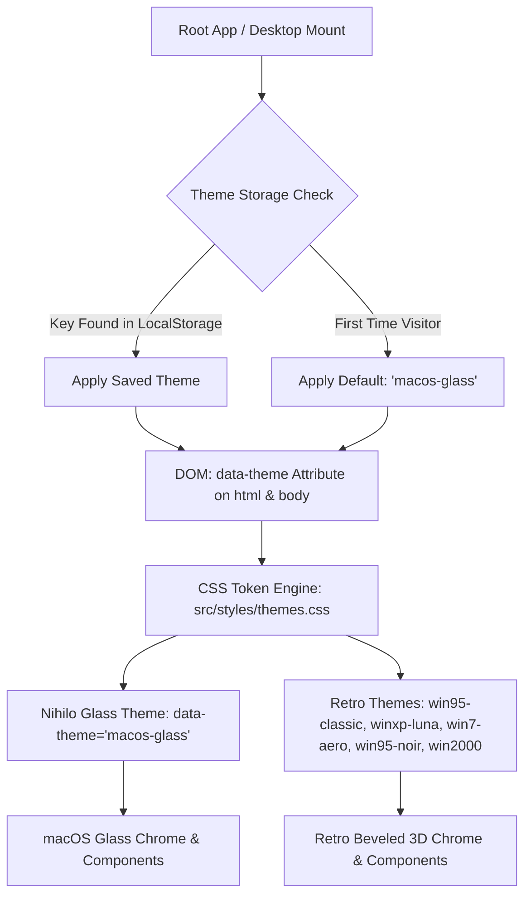

# Implementation Plan: "Nihilo Glass" (macOS Modern) Default Theme for ExNihilo-95

> **Role:** Senior Design Engineer & Product Designer  
> **Mode:** Planning Mode Only  
> **Target Release:** ExNihilo-95 v2.1.0  
> **Working Theme Name:** `macos-glass` ("Nihilo Glass")  
> **Default Status:** Set as default theme for all new visitors while preserving all classic nostalgia skins (Windows 95 Classic, Win95 Noir, Windows XP Luna, Windows 2000, Windows 7 Aero).

---

## 1. Audit Summary

### 1.1 Tech Stack & Tooling
* **Framework:** Next.js 16.3.2 (App Router) + React 19.2.8.
* **Styling:** Tailwind CSS v4 (`@tailwindcss/postcss`) + scoped CSS token stylesheets (`src/styles/themes.css`, `src/styles/win95.css`, `src/styles/crt.css`).
* **Editor:** CodeMirror 6 (`@codemirror/state`, `@codemirror/view`, `@codemirror/lang-sql`, `@codemirror/language`, `@lezer/highlight`).
* **Database & AST:** `sql.js` 1.14.2 (WASM SQLite kernel), `node-sql-parser` 5.4.0, `@faker-js/faker` 10.6.0.
* **Testing:** Vitest 4.1.11, Playwright 1.62.1.
* **Hosting:** Vercel with Analytics and Speed Insights.

### 1.2 Current Theme Architecture & State Management
* **Theme Definition:** `src/styles/themes.css` declares CSS variables scoped to `[data-theme="..."]` selectors on `:root` and `body`.
* **Theme Hook:** `src/hooks/useTheme.ts` manages active theme state via `localStorage.getItem('exnihilo_active_theme')` with a fallback to `'win95-classic'`. It applies `data-theme` to `document.documentElement` and `document.body`.
* **Current Theme Presets:** 5 presets (`win95-classic`, `win7-aero`, `win95-noir`, `winxp-luna`, `win2000`).
* **Theme Switcher:** Located in `src/components/Win95/SettingsDialog.tsx` under the "🎨 Display & Themes" tab.

### 1.3 Component Inventory with Theme-Specific Styling
* **Window Management:**
  * `src/components/Win95/Desktop.tsx` (desktop container, 3D wallpaper emblem, icon grid, CRT scanline overlay, window z-index layering).
  * `src/components/Win95/Taskbar.tsx` (bottom bar, start button, active window tabs, system tray with real-time clock, Start Menu popup).
  * `src/components/Win95/WindowControls.tsx` (titlebar minimize, maximize/restore, close buttons).
* **IDE Core Components:**
  * `src/components/IDE/IDEShell.tsx` (window shell, top menu bar, multi-tab query manager, drag splitters, status bar).
  * `src/components/IDE/Toolbar.tsx` (dialect selector, run button, SQL formatter, snippets, history toggle, workspace manager).
  * `src/components/IDE/QueryEditor.tsx` (CodeMirror 6 wrapper, syntax highlighting token themes, line gutters, error decorations).
  * `src/components/IDE/SchemaTree.tsx` (database explorer tree, context menus, search filter, table/column badges).
  * `src/components/IDE/ResultsGrid.tsx` (virtualized data table, column sort headers, quick filter, export dropdown, cell inspector modal).
  * `src/components/IDE/SnippetsPanel.tsx` (slide-out/embedded SQL snippets panel).
  * `src/components/IDE/ERDViewer.tsx` (Entity Relationship canvas).
  * `src/components/IDE/ExplainPlanViewer.tsx` (AST execution plan visualizer).
  * `src/components/IDE/CreateDatabaseDialog.tsx` & `CreateTableWizard.tsx` (schema authoring wizards).
* **Dialogs & Secondary Screens:**
  * `WelcomeWindow.tsx`, `HelpWindow.tsx`, `SQLDictionaryWindow.tsx`, `ChallengeWindow.tsx`, `SettingsDialog.tsx`, `AuthWindow.tsx`, `AdminDashboard.tsx`, `ContributorsWindow.tsx`, `LegalWindow.tsx`, `ShutDownDialog.tsx`, `ShareDialog.tsx`, `KeyboardShortcutsDialog.tsx`, `ErrorDialog.tsx`, `ErrorBoundary.tsx`, `MobileLanding.tsx`, `Win95Tour.tsx`.
* **Boot & Splash System:**
  * `src/components/Win95/BootAnimation.tsx` (BIOS memory check -> Windows 95 cloud splash marquee + Web Audio startup chime).

### 1.4 Animation & Bundle Size Impact
* **Current Library Footprint:** No heavy JS animation libraries installed (no Framer Motion or GSAP runtime bloat).
* **Proposed Motion Implementation:** Hardware-accelerated CSS custom properties, cubic-bezier spring easings (`cubic-bezier(0.16, 1, 0.3, 1)` and `cubic-bezier(0.32, 0.72, 0, 1)`), CSS 3D transforms, and WAAPI (Web Animations API).
* **Bundle Impact:** **0 kB net JS library weight added**. All animation runs off the main thread at native 60fps/120fps ProMotion speeds without interfering with SQLite WASM query parsing.

---

## 2. Design Specification: "Nihilo Glass" (macOS Modern)

### 2.1 Design Tokens (Source of Truth via `ui-ux-pro-max` & `antigravity-design-expert`)

```css
/* ─────────────────────────────────────────────────────────────────────────────
 * NIHILO GLASS — MACOS MODERN DESIGN TOKENS
 * ───────────────────────────────────────────────────────────────────────────── */
[data-theme="macos-glass"] {
  /* Surface & Background Palette (Dark Glass Default) */
  --mg-desktop-bg: radial-gradient(circle at 20% 20%, rgba(30, 58, 138, 0.65) 0%, transparent 40%),
                   radial-gradient(circle at 80% 80%, rgba(88, 28, 135, 0.55) 0%, transparent 45%),
                   radial-gradient(circle at 50% 50%, rgba(15, 118, 110, 0.35) 0%, transparent 50%),
                   #0b0f19;
  --mg-surface-base: rgba(18, 24, 38, 0.72);
  --mg-surface-elevated: rgba(26, 34, 52, 0.80);
  --mg-surface-sunken: rgba(10, 14, 23, 0.82);
  --mg-surface-hover: rgba(255, 255, 255, 0.08);
  --mg-surface-active: rgba(255, 255, 255, 0.14);
  
  /* Text & Foreground */
  --mg-text-primary: #f8fafc;
  --mg-text-secondary: #94a3b8;
  --mg-text-tertiary: #64748b;
  --mg-text-inverse: #0f172a;

  /* Accent & Status Colors */
  --mg-accent-primary: #38bdf8;          /* Electric Cyan / Sky */
  --mg-accent-run: #10b981;              /* Emerald Pro Execution */
  --mg-accent-run-hover: #059669;
  --mg-accent-warning: #f59e0b;          /* Amber */
  --mg-accent-danger: #f43f5e;           /* Rose */
  --mg-accent-purple: #a855f7;           /* Violet */
  --mg-focus-ring: rgba(56, 189, 248, 0.55);

  /* Glassmorphism Blur & Saturation */
  --mg-glass-blur-window: 28px;
  --mg-glass-blur-panel: 20px;
  --mg-glass-blur-popover: 32px;
  --mg-glass-blur-dock: 36px;
  --mg-glass-saturate: 190%;

  /* Glass Borders & Edge Highlights (Refraction) */
  --mg-border-subtle: rgba(255, 255, 255, 0.08);
  --mg-border-medium: rgba(255, 255, 255, 0.14);
  --mg-border-highlight: rgba(255, 255, 255, 0.22);
  --mg-inner-highlight: inset 0 1px 0 0 rgba(255, 255, 255, 0.15);
  --mg-inner-shadow: inset 0 2px 4px 0 rgba(0, 0, 0, 0.35);

  /* Elevation & Shadows */
  --mg-shadow-window: 0 24px 48px -12px rgba(0, 0, 0, 0.55), 0 0 0 1px rgba(255, 255, 255, 0.10);
  --mg-shadow-window-focused: 0 32px 64px -12px rgba(0, 0, 0, 0.70), 0 0 0 1px rgba(56, 189, 248, 0.25), 0 0 24px 0 rgba(56, 189, 248, 0.12);
  --mg-shadow-modal: 0 40px 80px -16px rgba(0, 0, 0, 0.75), 0 0 0 1px rgba(255, 255, 255, 0.14);
  --mg-shadow-popover: 0 16px 32px -8px rgba(0, 0, 0, 0.5), 0 0 0 1px rgba(255, 255, 255, 0.12);
  --mg-shadow-dock: 0 20px 40px -8px rgba(0, 0, 0, 0.6), 0 0 0 1px rgba(255, 255, 255, 0.15);

  /* Squircle Corner Radii Scale */
  --mg-radius-window: 14px;
  --mg-radius-modal: 16px;
  --mg-radius-panel: 10px;
  --mg-radius-button: 8px;
  --mg-radius-input: 8px;
  --mg-radius-tab: 8px;
  --mg-radius-pill: 9999px;

  /* Typography Stacks */
  --mg-font-ui: -apple-system, BlinkMacSystemFont, "SF Pro Display", "SF Pro Text", "Inter", "Segoe UI", system-ui, sans-serif;
  --mg-font-code: "SF Mono", "JetBrains Mono", "Fira Code", Menlo, Monaco, "Courier New", monospace;

  /* macOS Traffic Light Control Buttons */
  --mg-traffic-close: #ff5f56;
  --mg-traffic-close-border: #e0443e;
  --mg-traffic-minimize: #ffbd2e;
  --mg-traffic-minimize-border: #dea123;
  --mg-traffic-maximize: #27c93f;
  --mg-traffic-maximize-border: #1aab29;
}
```

### 2.2 Motion Specification (`emil-design-eng` / Apple Motion Craft)

| Interaction | Duration | Curve / Physics | Properties Animated | Behavior & Details |
|---|---|---|---|---|
| **Window Open / Modal Entrance** | `240ms` | `cubic-bezier(0.16, 1, 0.3, 1)` | `transform`, `opacity` | Starts at `scale(0.96) translateY(8px)` + `opacity: 0`. Settles smoothly without bouncy overshoot. |
| **Window Close / Dismiss** | `160ms` | `cubic-bezier(0.4, 0, 1, 1)` | `transform`, `opacity` | Exits faster than entrance: `scale(0.96) translateY(6px)` + `opacity: 0`. |
| **Window Minimize to Dock** | `220ms` | `cubic-bezier(0.2, 0.9, 0.3, 1)` | `transform`, `opacity` | Slides toward bottom dock with subtle scale contraction. |
| **Button Press Feedback** | `120ms` | `cubic-bezier(0.25, 1, 0.5, 1)` | `transform` | `:active` scales down to `scale(0.97)` for instant tactile click response. |
| **Popover / Context Menu Open** | `150ms` | `cubic-bezier(0.16, 1, 0.3, 1)` | `transform`, `opacity` | Origin-aware (`transform-origin: top left`), enters from `scale(0.96)`. |
| **Tab Switch / Selection** | `180ms` | `cubic-bezier(0.2, 0.8, 0.2, 1)` | `background-color`, `box-shadow` | Fluid crossfade with hardware-accelerated indicator glide. |
| **Results Grid Row Hover** | `120ms` | `ease-out` | `background-color` | High-responsiveness row highlighting without lag. |
| **Hover Glow on Traffic Lights** | `140ms` | `ease-out` | `opacity` | Micro glyphs (`✕`, `−`, `+`) fade in on hover like native macOS. |

#### Accessibility & Hardware Acceleration Fallbacks:
* `@media (prefers-reduced-motion: reduce)`: All `transform` translations and scaling are completely disabled. Transitions gracefully drop to simple `opacity` crossfades (max `100ms`).
* `@media (prefers-reduced-transparency: reduce)`: `backdrop-filter: none !important;`, surfaces default to opaque solid dark slate `#111827` with 100% opacity to prevent legibility issues.

### 2.3 Component-by-Component Restyle Plan

1. **Desktop & Ambient Wallpaper Canvas:**
   - Multi-layered Aurora glass ambient background with gentle animated radial highlights that illuminate through translucent windows.
   - Desktop icons redesigned as clean rounded-squircle high-resolution cards with crisp text labels and drop shadows.
2. **macOS Floating Dock (Replacing Taskbar):**
   - Centered floating bottom glass dock with continuous 18px squircle radius, 36px backdrop blur, and subtle inner glass reflection.
   - Pinned and running apps display glowing indicator dots underneath.
   - Apple-style Start / App Launcher menu popup with categorized pro layout.
   - Right-side glass system tray with real-time clock, user profile pill, and live status badges.
3. **Window Chrome & macOS Traffic Lights (`WindowControls.tsx`):**
   - Native macOS 3-button traffic light stack (🔴 Close, 🟡 Minimize, 🟢 Zoom/Maximize) with crisp 12px circular discs and inner stroke.
   - On window titlebar hover, micro symbols (`✕`, `−`, `+`) become visible inside the buttons.
   - Dual-zone titlebars: Glassy top header with integrated toolbar tabs, breadcrumbs, and subtle drag handle.
4. **IDE Shell & Navigation Splitters:**
   - Seamless translucent panels with thin 1px frosted glass dividers.
   - Smooth resize handles with subtle neon cyan glow on hover.
5. **Action Toolbar (`Toolbar.tsx`):**
   - Segmented glass control groups: Run button with vibrant Emerald glass glow (`bg-emerald-500/90 hover:bg-emerald-400`), SQL Formatter, Snippets, Dialect selector as macOS-style glass pill popover.
6. **Query Editor (`QueryEditor.tsx` & CodeMirror 6):**
   - Deep translucent editor canvas with subtle active line glow (`rgba(56, 189, 248, 0.08)`).
   - Premium modern dark syntax highlighting theme (Vibrant Sky Blue keywords, Emerald green strings, Electric Violet numbers/types, Coral red operators, Muted slate comments).
   - Sleek minimalist line number gutter with zero-clutter layout.
7. **Database Navigator (`SchemaTree.tsx`):**
   - Translucent sidebar pane with macOS Finder / Xcode style collapsible disclosure chevrons (`›` / `ˇ`).
   - Clean vector badges for Primary Keys (🔑), Foreign Keys (🔗), and column data types (`INT`, `VARCHAR`, `TIMESTAMP`).
   - Glassmorphic context menus with smooth hover pill backdrops.
8. **Virtual Results Grid (`ResultsGrid.tsx`):**
   - Sleek modern data table with sticky glass header, subtle alternating row translucency, inline quick-search filter, column sort indicators, and export pills (CSV, JSON, SQL INSERTs).
   - Cell inspector modal with formatted JSON / multiline text viewer.
9. **Dialogs & Secondary Modals (Settings, Challenges, Dictionary, Auth, Admin):**
   - macOS sheet & modal presentation: `border-radius: 16px`, deep ambient drop shadows, frosted acrylic background blur, macOS segmented tab bars.
10. **Scrollbars:**
    - macOS-style overlay scrollbars: slim 6px rounded pills that fade out when inactive and expand slightly to 8px on hover, without shifting layout.

### 2.4 macOS Glass Boot Animation Storyboard

* **Trigger:** Initial desktop launch or manual restart via Shutdown dialog.
* **Duration:** 2.2 seconds total (skippable instantly by any click or keypress).
* **Storyboard:**
  * **Frame 1 (0.0s – 0.5s):** Deep cinematic black background. A minimalist glowing white glass Prism Logo of ExNihilo fades in with a gentle ambient bloom.
  * **Frame 2 (0.5s – 1.8s):** An Apple-style rounded progress track (220px × 4px) smoothly fills from 0% to 100% with animated status text below:
    * `0.5s`: *"Initializing WASM Relational Kernel..."*
    * `0.9s`: *"Mounting Dynamic Schema Engine..."*
    * `1.3s`: *"Optimizing Query Execution DAG..."*
    * `1.6s`: *"Launching Nihilo Glass Studio..."*
  * **Audio Chime:** A crystal-clear Web Audio synthesized Mac startup chime (F# major chord with warm stereo harmonics and soft decay).
  * **Frame 3 (1.8s – 2.2s):** Logo and progress bar expand gently (`scale(1.04)`) and fade out into the live Nihilo Glass desktop.

---

## 3. Architecture Plan



### 3.1 Theme Registry & Pluggability
* In `src/hooks/useTheme.ts`:
  * Define `ThemeId = 'macos-glass' | 'win95-classic' | 'win7-aero' | 'win95-noir' | 'winxp-luna' | 'win2000'`.
  * Add `macos-glass` as the **first entry** in `THEME_PRESETS`.
  * Update default state resolution:
    ```typescript
    const DEFAULT_THEME: ThemeId = 'macos-glass';
    ```
* **User Migration Strategy:**
  * If a visitor is brand new (`localStorage.getItem('exnihilo_active_theme') === null`), they receive `'macos-glass'` immediately.
  * If an existing visitor has a saved preference, their selected theme is honored.
  * If they want to switch between macOS Modern and Windows XP / 95 / 7, they can do so in Settings -> Display & Themes or the Taskbar/Dock at any time.

### 3.2 Eliminating Style Leakage
* All new glassmorphism and macOS styling rules will be strictly prefixed under `[data-theme="macos-glass"]`.
* Classic `.win95-*` CSS definitions will remain untouched for when `data-theme="win95-classic"` (or other retro themes) are active.
* When `data-theme="macos-glass"` is active, scoped overrides in `themes.css` will transform `.win95-window`, `.win95-button`, `.win95-taskbar`, `.win95-grid`, etc. into their modern Mac counterparts.

### 3.3 Flash of Wrong Theme Prevention
* In `src/app/layout.tsx` or `page.tsx`, ensure an inline script or fast hydration hook applies `data-theme="macos-glass"` (or stored theme) before initial paint to prevent any FOUC (Flash of Unstyled Content).

---

## 4. Performance, Quality & Accessibility Guardrails

1. **GPU & Backdrop-Filter Performance Budget:**
   - Use `-webkit-backdrop-filter` alongside `backdrop-filter`.
   - Limit heavy multi-layer blur nesting to maximum 2 layers (Window + Popover).
   - Inset scrollable data grids use semi-transparent solid tint (`rgba(10, 14, 23, 0.85)`) rather than nested backdrop filters, preventing GPU jank when scrolling 10,000+ virtual rows.
2. **Layout Thrash Prevention:**
   - All drag, minimize, and maximize interactions use CSS `transform: translate3d(...)` and `scale(...)`. No animation of `top`, `left`, `width`, or `height`.
3. **Contrast & WCAG Compliance:**
   - All text tokens maintain minimum 4.5:1 contrast against their respective glass background tones.
   - Keyboard focus rings are prominent (`box-shadow: 0 0 0 2px rgba(56, 189, 248, 0.6)`).
4. **Zero Impact on SQL Engine & Schema Inference:**
   - 100% of underlying business logic (`SQLExecutor`, `catalog.ts`, `parser.ts`, `sql_exporter.ts`, `useWorkspaceStorage.ts`) remains completely intact and unaltered.

---

## 5. Phased Implementation Roadmap

```mermaid
gantt
  title Nihilo Glass Implementation Timeline
  dateFormat  X
  axisFormat  Phase %s
  section Core System
  Phase 1 : Tokens & Theme Engine        :p1, 0, 1
  Phase 2 : Window Chrome & Traffic Lights:p2, 1, 2
  Phase 3 : Desktop Canvas & Floating Dock:p3, 2, 3
  section IDE & Components
  Phase 4 : Core IDE Surfaces & Editor   :p4, 3, 4
  Phase 5 : Dialogs, Modals & Tools       :p5, 4, 5
  section Experience & Ship
  Phase 6 : Glass Boot Animation & Chime  :p6, 5, 6
  Phase 7 : Polish, Testing & Set Default :p7, 6, 7
```

### Phase 1: Tokens & Theme Architecture
* **Goal:** Establish all design variables, update `useTheme.ts`, and wire the theme engine for `macos-glass`.
* **Files to modify/create:**
  * `src/hooks/useTheme.ts` (Add `macos-glass` preset, update `ThemeId`, set default).
  * `src/styles/themes.css` (Add `[data-theme="macos-glass"]` CSS token palette, typography, glass filters, elevation, and base resets).
  * `src/tests/components/themes.test.ts` (Update unit tests for 6 theme presets with `macos-glass` as primary).

### Phase 2: Window Chrome, Titlebars & macOS Traffic Lights
* **Goal:** Transform window frames, titlebars, and controls into native-feeling macOS acrylic windows.
* **Files to modify/create:**
  * `src/components/Win95/WindowControls.tsx` (Add support for macOS traffic light buttons with hover glyphs).
  * `src/styles/themes.css` (Add window chrome, header styling, squircle radii, and inner highlight rules for `macos-glass`).

### Phase 3: Desktop Environment & macOS Floating Dock
* **Goal:** Build the immersive Aurora glass desktop and floating Mac dock.
* **Files to modify/create:**
  * `src/components/Win95/Desktop.tsx` (Update desktop container, wallpaper graphics, icon grid).
  * `src/components/Win95/Taskbar.tsx` (Implement floating bottom glass dock layout, app active dots, system tray clock pill).
  * `src/styles/themes.css` (Dock styling, backdrop blur, hover magnification states).

### Phase 4: Core IDE Surfaces (Toolbar, Query Editor, Tabs, Splitters, Results Grid, Schema Tree)
* **Goal:** Restyle all primary developer studio workflows into a sleek pro SaaS IDE.
* **Files to modify/create:**
  * `src/components/IDE/IDEShell.tsx` (Menu bar, splitters, tab bar, status bar).
  * `src/components/IDE/Toolbar.tsx` (Segmented glass execution controls, run button, dialect pill).
  * `src/components/IDE/QueryEditor.tsx` (CodeMirror 6 macOS modern syntax theme).
  * `src/components/IDE/SchemaTree.tsx` (Finder-style sidebar explorer, badges, context menus).
  * `src/components/IDE/ResultsGrid.tsx` (Glass header data table, search filter, export pills).

### Phase 5: Dialogs, Modals & Secondary Tools
* **Goal:** Restyle all secondary windows, wizards, and panels.
* **Files to modify/create:**
  * `src/components/Win95/SettingsDialog.tsx` (Updated theme selector with macOS Modern preview).
  * `src/components/Win95/WelcomeWindow.tsx`, `HelpWindow.tsx`, `ChallengeWindow.tsx`, `SQLDictionaryWindow.tsx`, `AdminDashboard.tsx`, `AuthWindow.tsx`, `ShutDownDialog.tsx`, `ShareDialog.tsx`, `KeyboardShortcutsDialog.tsx`, `ContributorsWindow.tsx`, `LegalWindow.tsx`, `MobileLanding.tsx`.
  * `src/components/IDE/SnippetsPanel.tsx`, `ERDViewer.tsx`, `ExplainPlanViewer.tsx`, `CreateDatabaseDialog.tsx`, `CreateTableWizard.tsx`.

### Phase 6: macOS Glass Boot Animation & Sound Chime
* **Goal:** Create the matching pro loading experience with Apple-style progress track and Web Audio startup chime.
* **Files to modify/create:**
  * `src/components/Win95/BootAnimation.tsx` (macOS boot mode, minimalist glowing mark, smooth pill progress bar, crystal startup chime, skip handler).

### Phase 7: Polish, Accessibility, Responsive QA & Set as Default
* **Goal:** Verify contrast, reduced-motion, mobile responsiveness, run all automated test suites, and confirm default status.
* **Files to verify:**
  * E2E and unit test suites (`npm run test:e2e`, `vitest run`).
  * Cross-browser backdrop filter check.

---

## 6. File-by-File Change List per Phase

| File | Phase | Scope of Changes |
|---|---|---|
| `src/hooks/useTheme.ts` | Phase 1 | Add `'macos-glass'` to `ThemeId`, add metadata in `THEME_PRESETS`, set as default. |
| `src/styles/themes.css` | Phase 1-5 | Implement `[data-theme="macos-glass"]` token system, glass layers, CodeMirror styles, and component overrides. |
| `src/tests/components/themes.test.ts` | Phase 1 | Update unit test expectations for 6 presets and default theme validation. |
| `src/components/Win95/WindowControls.tsx` | Phase 2 | Render macOS traffic lights (🔴 🟡 🟢) with hover glyphs under `macos-glass` theme. |
| `src/components/Win95/Desktop.tsx` | Phase 3 | Add Aurora glass wallpaper variant and modernized desktop icons. |
| `src/components/Win95/Taskbar.tsx` | Phase 3 | Floating glass dock layout, indicator dots, system tray glass pill. |
| `src/components/IDE/IDEShell.tsx` | Phase 4 | Restyle tab headers, splitters, menu bar, and status bar for macOS. |
| `src/components/IDE/Toolbar.tsx` | Phase 4 | Pro segmented glass controls, Emerald execution button, dialect pill. |
| `src/components/IDE/QueryEditor.tsx` | Phase 4 | Modern CodeMirror theme extension with vibrant colors and gutter styling. |
| `src/components/IDE/SchemaTree.tsx` | Phase 4 | macOS Finder styling, key badges, context menus. |
| `src/components/IDE/ResultsGrid.tsx` | Phase 4 | Sleek data grid headers, search box, export buttons, cell modal. |
| `src/components/Win95/SettingsDialog.tsx` | Phase 5 | Theme switcher card update with Nihilo Glass badge & gradient. |
| Secondary Modals (`WelcomeWindow.tsx`, etc.) | Phase 5 | Acrylic window styling and rounded segmented controls. |
| `src/components/Win95/BootAnimation.tsx` | Phase 6 | Dual-mode boot animation (macOS Glass default vs Classic Windows 95 if retro skin chosen). |

---

## 7. Risks, Open Questions & Rollback Strategy

### 7.1 Risks & Mitigations
* **Risk 1: Browser `backdrop-filter` rendering differences (e.g., older Safari or Firefox on Linux).**
  * *Mitigation:* Provide both `-webkit-backdrop-filter` and solid semi-translucent fallback backgrounds (`background: rgba(18, 24, 38, 0.92)`).
* **Risk 2: Heavy rendering cost when many windows are open.**
  * *Mitigation:* Only focused and visible windows carry full blur; background inactive windows use lighter blur or flat tint; DOM virtualization in ResultsGrid prevents excessive nodes.
* **Risk 3: Accidental style breakage for existing Windows 95/XP lovers.**
  * *Mitigation:* Strict CSS scoping: all new rules live under `[data-theme="macos-glass"]`. Retro styles remain 100% intact under their respective data-themes.

### 7.2 Open Questions (Resolved in Spec)
* *Q: Should Windows XP/95 users be forced into macOS theme?*
  * *A:* No. If a user has an existing saved theme in `localStorage`, their choice is respected. Only new users default to Nihilo Glass.
* *Q: Should the boot animation be theme-dependent?*
  * *A:* Yes! When Nihilo Glass is active, it runs the sleek Apple-style loader. When Windows 95/XP is active, it runs the classic DOS/Cloud loader.

### 7.3 Rollback Strategy
* The entire new theme is additive and CSS-scoped. If any issue arises, setting `DEFAULT_THEME = 'win95-classic'` in `useTheme.ts` instantly reverts the default experience without breaking any code.

---

## 8. Acceptance Checklist & Visual QA

### 8.1 Visual QA Checklist
- [ ] Windows have 14px continuous squircle rounded corners and translucent frosted glass borders.
- [ ] Window titlebars display macOS traffic lights (🔴 🟡 🟢) on the top-left with hover symbols.
- [ ] Bottom taskbar operates as a floating frosted glass dock with active application dots.
- [ ] Action Toolbar features a glowing Emerald "Run" button and segmented glass controls.
- [ ] CodeMirror 6 query editor has dark glass canvas, active line glow, and high-contrast syntax highlighting.
- [ ] Results grid renders sticky glass column headers, zebra row tints, and smooth scrolling.
- [ ] Schema Tree renders macOS Finder-style hierarchy with vector key/type badges.
- [ ] Settings Dialog allows instant 1-click switching between Nihilo Glass and all 5 retro Windows skins.
- [ ] Boot animation shows glowing prism logo + sleek progress bar + synthesized startup chord.

### 8.2 Technical & Accessibility QA
- [ ] Contrast ratio on all text elements meets or exceeds WCAG AA (4.5:1).
- [ ] `prefers-reduced-motion` disables all spring scales and translates.
- [ ] `prefers-reduced-transparency` swaps backdrop blurs for solid high-contrast dark tones.
- [ ] No layout shifts (CLS = 0) during window drag or tab switching.
- [ ] All Vitest unit tests pass (`npm run test:e2e` and `vitest run`).
- [ ] Build completes cleanly with zero TypeScript errors (`npm run build`).

---

## 9. Skill Usage Map

| Skill | Specific Contribution to Plan |
|---|---|
| **`antigravity-design-expert`** | Formulated the multi-tier Z-depth glassmorphism architecture, backdrop-filter saturation formula, and ambient Aurora gradient desktop canvas. |
| **`ui-ux-pro-max`** | Provided the foundational token contract (palette, semantic CSS variables, squircle radii scale, elevation levels, and typography stack). |
| **`frontend-design`** | Defined the distinctive "Nihilo Glass Studio" aesthetic direction, avoiding generic AI-purple clichés and anchoring the pro developer feel. |
| **`design-taste-frontend`** | Conducted visual hierarchy review, single accent lock (Emerald Run / Electric Cyan), density discipline for SQL data grid, and contrast verification. |
| **`emil-design-eng`** | Crafted the complete motion spec: custom cubic-bezier spring curves, asymmetric enter/exit timings (240ms in, 160ms out), `:active` scale(0.97) tactile feedback, and hardware-accelerated transform rules. |
